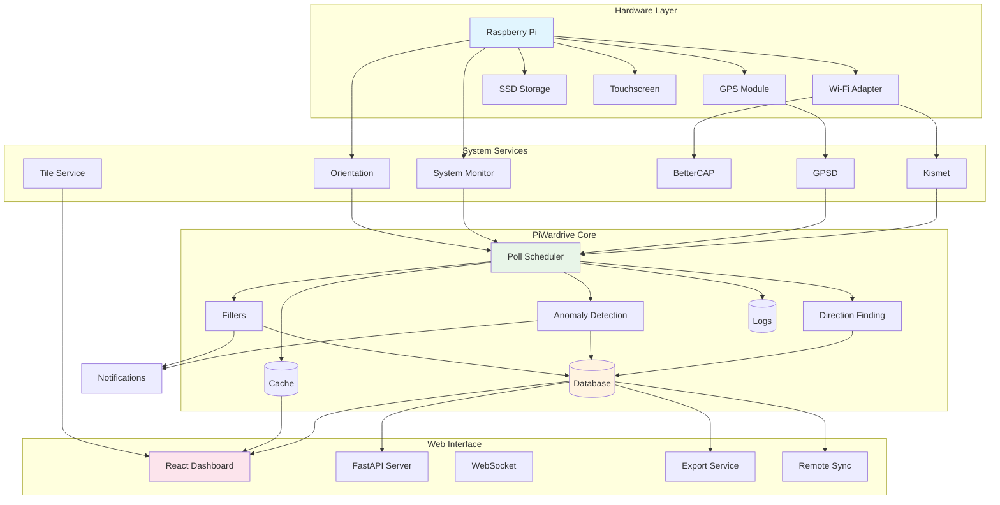
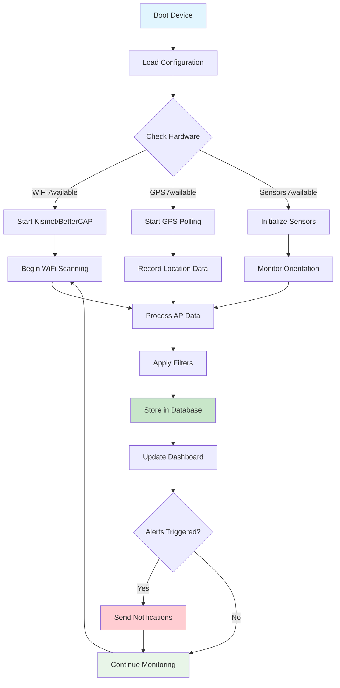
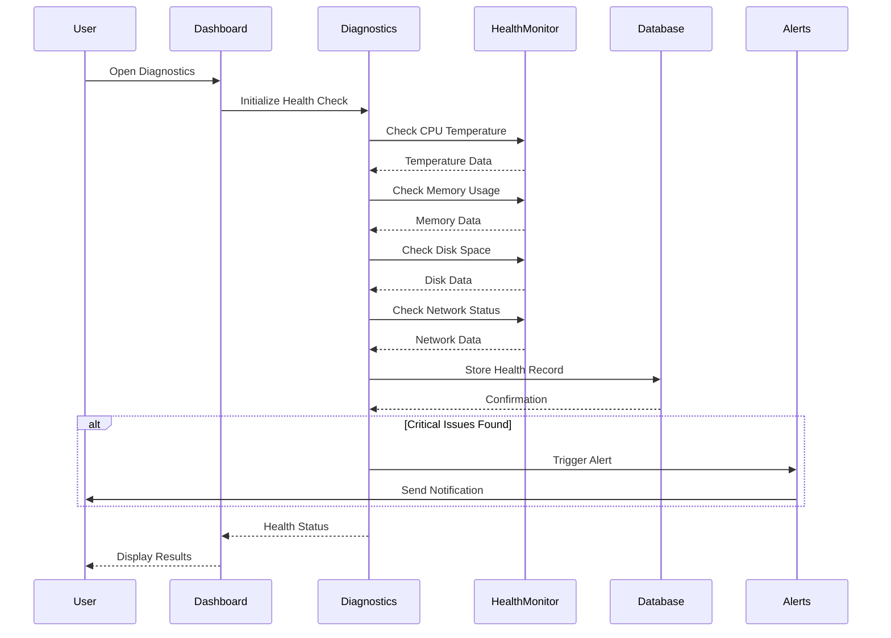
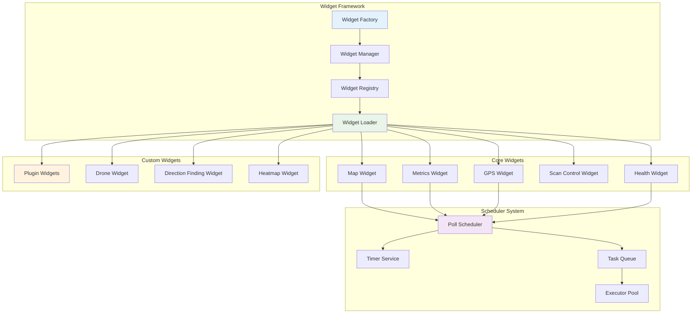
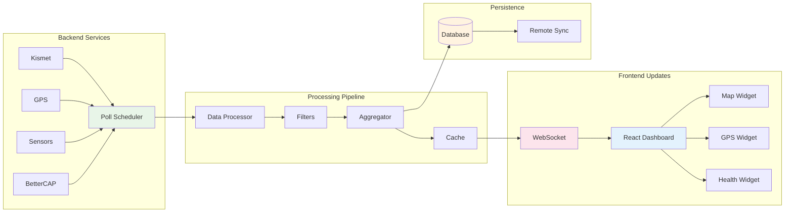
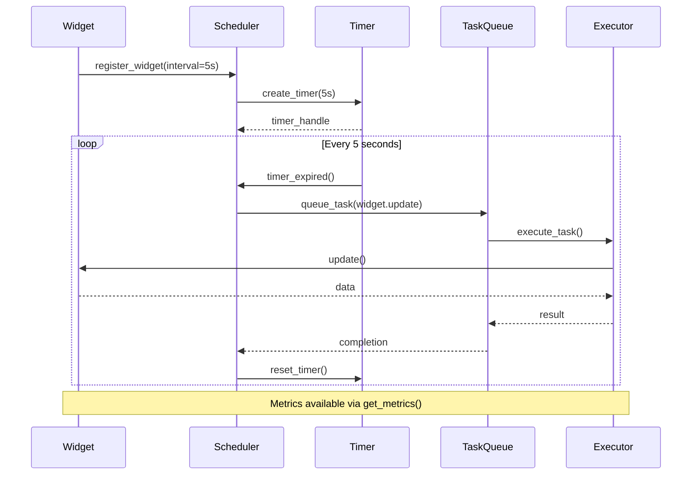

# PiWardri## Table of Contents

-   [🚀 Quick Start](#quick-start)
-   [✨ Features](#features)
-   [🏗️ Architecture](#architecture)
-   [🔧 Configuration](#configuration)
-   [📊 Usage Examples](#usage-examples)
-   [🛠️ CLI Tools & Scripts](#cli-tools--scripts)
-   [🚨 Field Support & Maintenance](#field-support--maintenance)
-   [🐳 Docker Deployment](#docker-deployment)
-   [📚 Documentation](#documentation)
-   [🤝 Contributing](#contributing)
-   [🛡️ Legal Notice](#legal-notice)
-   [📄 License](#license)lysis & IoT Monitoring System

[](https://github.com/TrashyTalk/piwardrive/actions)
[](https://hub.docker.com/r/trashytalk/piwardrive)
[](LICENSE)
[](https://python.org)
[](https://nodejs.org)
[](docs/)
[](docs/field-troubleshooting-guide.md)

## Table of Contents

-   [🚀 Quick Start](#quick-start)
-   [✨ Features](#features)
-   [🏗️ Architecture](#architecture)
-   [🔧 Configuration](#configuration)
-   [📊 Usage Examples](#usage-examples)
-   [�️ CLI Tools & Scripts](#cli-tools--scripts)
-   [🚨 Field Support & Maintenance](#field-support--maintenance)
-   [�🐳 Docker Deployment](#docker-deployment)
-   [📚 Documentation](#documentation)
-   [🤝 Contributing](#contributing)
-   [🛡️ Legal Notice](#legal-notice)
-   [📄 License](#license)

<div align="center">
  
  
  <h3>Real-time Wi-Fi Analysis & IoT Monitoring Platform</h3>
  
  <p>A comprehensive, field-ready system for wireless network analysis, IoT monitoring, and edge computing deployments. Built for reliability, scalability, and ease of use in both research and production environments.</p>
  
  <p><strong>🎯 Production Ready:</strong> 50+ CLI tools • Comprehensive field support • Enterprise deployment options • Extensive documentation</p>
  
  
</div>

### Key Highlights

-   📡 **Real-time Wi-Fi Scanning** - Monitor access points and connected devices
-   📊 **Interactive Dashboard** - Customizable widgets and real-time charts
-   🌍 **GPS Integration** - Location-aware network mapping and geofencing
-   🏠 **IoT Monitoring** - System health and resource tracking
-   🛠️ **Field Support Tools** - Comprehensive diagnostics and maintenance
-   🔧 **Automation & Scripting** - 50+ CLI tools for management and analysis
-   📱 **Mobile-Ready** - Responsive UI and mobile diagnostics
-   🚀 **High Performance** - Optimized for edge computing and real-time analysis
-   🐳 **Easy Deployment** - Docker, systemd, or development setups
-   📈 **Scalable Architecture** - Single device to enterprise-grade deployments

## Prerequisites

### Hardware Requirements

-   **Recommended**: Raspberry Pi 5 with 7" touchscreen
-   **Minimum**: Raspberry Pi 4 or equivalent ARM/x86 device
-   **Storage**: 8GB+ SD card or storage device
-   **Network**: Wi-Fi adapter with monitor mode support

### Software Requirements

-   **Operating System**: Linux (Raspberry Pi OS, Ubuntu 20.04+)
-   **Python**: 3.10 or higher
-   **Node.js**: 18.x or higher (for web UI development)
-   **Docker**: 20.10+ (for containerized deployment)
-   **Optional**: Kismet, BetterCAP, GPSD for advanced features

### Network Permissions

⚠️ **Legal Notice**: Ensure you have proper authorization before scanning wireless networks in your area. Check local regulations regarding wireless monitoring.

### Supported Wi-Fi Adapters

-   **Recommended**: USB adapters with monitor mode support
-   Ralink RT5370/RT5372
-   Atheros AR9271  
-   Realtek RTL8188CUS
-   **Complete List**: See [Hardware Compatibility Guide](docs/hardware-compatibility.md)

## 🚀 Quick Start

### Option 1: Docker (Recommended)

```bash
# Clone the repository
git clone https://github.com/TrashyTalk/piwardrive.git
cd piwardrive

# Start with Docker Compose
docker compose up -d

# Access the dashboard
open http://localhost:8000
```

### Option 2: Native Installation

```bash
# Install system dependencies (Ubuntu/Debian)
sudo apt update && sudo apt install -y git build-essential cmake \
    kismet bettercap gpsd evtest python3-venv nodejs npm

# Clone and setup
git clone https://github.com/TrashyTalk/piwardrive.git
cd piwardrive

# Install Python dependencies
python3 -m venv gui-env
source gui-env/bin/activate
pip install -r requirements.txt
pip install .

# Install and build Web UI
cd webui
npm install
npm run build
cd ..

# Run the service
piwardrive-webui
```

### First-Time Setup

1. Navigate to `http://localhost:8000`
2. Complete the initial configuration wizard
3. Configure your Wi-Fi adapter settings
4. Start monitoring!

## ✨ Features

### Wi-Fi Analysis & Monitoring


-   **Real-time Scanning**: Continuous monitoring of wireless networks
-   **Signal Strength Mapping**: RSSI tracking and heat map visualization
-   **Device Detection**: Identify connected and nearby devices
-   **Channel Analysis**: Frequency usage and interference detection
-   **Historical Data**: Trend analysis and comprehensive reporting
-   **Geofencing**: Location-based network monitoring zones
-   **Anomaly Detection**: Automated identification of unusual network activity

### System & IoT Monitoring

-   **Resource Tracking**: CPU, RAM, storage, and temperature monitoring
-   **Network Statistics**: Bandwidth usage and connection health
-   **GPS Integration**: Location-aware data collection with offline mapping
-   **Alert System**: Configurable notifications for system anomalies
-   **Remote Sync**: Database synchronization with aggregation servers
-   **Performance Metrics**: Real-time system performance analysis
-   **Health Monitoring**: Automated system health checks and reporting

### Advanced Features

-   **Orientation Sensors**: Antenna bearing and directional analysis
-   **UAV Integration**: Aerial network mapping and drone flight recording
-   **Multi-device Support**: Centralized monitoring of distributed sensors
-   **Bluetooth Scanning**: Device discovery and proximity detection
-   **Tile Caching**: Predictive map tile downloading for offline operation
-   **Vector Tiles**: Custom map rendering and geographic data overlay

### Web Dashboard


-   **Customizable Widgets**: Drag-and-drop dashboard configuration
-   **Real-time Charts**: Live updating graphs and performance meters
-   **Data Export**: CSV, JSON, GPX, and Shapefile export capabilities
-   **Offline Maps**: Predictive tile caching and geofencing support
-   **Service Controls**: Start/stop Kismet and BetterCAP from the UI
-   **GraphQL API**: Advanced API access with `PW_ENABLE_GRAPHQL=true`
-   **Multi-device Support**: Centralized monitoring dashboard
-   **Mobile Responsive**: Optimized for tablets and smartphones
-   **Kiosk Mode**: Full-screen operation for dedicated displays
-   **Internationalization**: Multi-language support and localization
-   **Plugin System**: Extensible widget architecture
-   **Theme Support**: Customizable UI themes and branding

### Use Cases

-   **Network Administration**: Monitor enterprise Wi-Fi infrastructure
-   **Field Operations**: Remote deployment with comprehensive diagnostics
-   **IoT Edge Computing**: Distributed sensor networks and data aggregation
-   **Research Projects**: Wireless environment studies and data analysis
-   **Security Assessment**: Network monitoring and anomaly detection
-   **Home Automation**: Personal network monitoring and smart home integration
-   **Event Monitoring**: Temporary deployment for conferences and gatherings
-   **UAV/Drone Operations**: Aerial network mapping and coverage analysis

## 🏗️ Architecture

<div align="center">
  
</div>

### System Components

#### Backend Services

```
┌─────────────────┐    ┌─────────────────┐    ┌─────────────────┐
│   Wi-Fi Scanner │    │  System Monitor │    │   GPS Service   │
│   (Python)      │    │   (Python)      │    │   (Python)      │
└─────────────────┘    └─────────────────┘    └─────────────────┘
         │                       │                       │
         └───────────────────────┼───────────────────────┘
                                 │
                    ┌─────────────────┐
                    │   Core Service  │
                    │ (FastAPI/ASGI)  │
                    └─────────────────┘
                                 │
                    ┌─────────────────┐
                    │   Database      │
                    │   (SQLite)      │
                    └─────────────────┘
```

#### Frontend Architecture

```
┌─────────────────┐    ┌─────────────────┐    ┌─────────────────┐
│   React App     │    │   Widget System │    │   API Client    │
│   (TypeScript)  │    │   (Components)  │    │   (Axios)       │
└─────────────────┘    └─────────────────┘    └─────────────────┘
         │                       │                       │
         └───────────────────────┼───────────────────────┘
                                 │
                    ┌─────────────────┐
                    │   Web Server    │
                    │   (Nginx)       │
                    └─────────────────┘
```

### Data Flow

1. **Collection**: Wi-Fi scanner and system monitors collect data
2. **Processing**: Core service processes and stores data
3. **API**: REST endpoints serve data to frontend
4. **Visualization**: React dashboard displays real-time information
5. **Export**: Data can be exported or synchronized to aggregation service

## 📊 System Architecture Diagrams

### Complete System Overview



### Scanning and Data Processing Flow



### Diagnostics and Health Monitoring



### Widget and Scheduler Architecture



### Real-time Update and Communication Flow



### Scheduler Event and Task Management



### Deployment Options

-   **Standalone**: Single device with web interface
-   **Distributed**: Multiple sensors with central aggregation
-   **Kiosk Mode**: Full-screen dashboard for dedicated displays
-   **Development**: Local development with hot-reload

## 🔧 Configuration

PiWardrive stores its configuration in `~/.config/piwardrive/config.json`. Profiles
under `~/.config/piwardrive/profiles` can be selected with the `PW_PROFILE_NAME`
environment variable.

### Key Configuration Options

-   `PW_WEBUI_PORT` – Web interface port (default `8000`)
-   `PW_DISABLE_ANOMALY_DETECTION` – Disable health monitoring
-   `PW_REMOTE_SYNC_URL` – Endpoint for database synchronization
-   `PW_ENABLE_GRAPHQL` – Enable GraphQL API endpoint
-   `PW_KIOSK_MODE` – Run in full-screen kiosk mode
-   `PW_ENABLE_BLUETOOTH` – Enable Bluetooth device scanning
-   `PW_GPS_ENABLED` – Enable GPS location services
-   `PW_PROFILE_NAME` – Configuration profile to use

### Profile Management

Use the configuration CLI tool to manage profiles:

```bash
# Create a new profile
config-cli create-profile --name field-deployment

# Switch to a profile
export PW_PROFILE_NAME=field-deployment

# List available profiles
config-cli list-profiles

# Validate configuration
config-cli validate
```

### Hardware Configuration

Configure Wi-Fi adapters and sensors:

```bash
# Check supported Wi-Fi adapters
check-orientation-sensors

# Calibrate compass and gyroscope
calibrate-orientation

# Test GPS functionality
service-status --gps
```

See [docs/configuration.rst](docs/configuration.rst) for complete configuration reference and [docs/config_schema.json](docs/config_schema.json) for the JSON schema.

## 📊 Usage Examples

Start only the API service with Uvicorn:

```bash
uvicorn piwardrive.service:app --reload
```

Run the full dashboard:

```bash
piwardrive-webui
```

Download map tiles without starting the UI:

```bash
piwardrive-prefetch --help
```

Export data in various formats:

```bash
# Export GPS tracks as GPX
export-gpx --output tracks.gpx

# Export Wi-Fi data as Shapefile
export-shp --output wifi_data.shp

# Export system metrics to Grafana
export-grafana --dashboard system-metrics
```

## 🛠️ CLI Tools & Scripts

PiWardrive includes over 50 command-line tools for management, analysis, and maintenance:

### Core Services

-   `piwardrive-service` - Start the main API service
-   `piwardrive-webui` - Launch the web dashboard
-   `service-status` - Check service health and status
-   `piwardrive-kiosk` - Run in full-screen kiosk mode

### Data Management

-   `piwardrive-vacuum` - Optimize database performance
-   `piwardrive-migrate` - Database schema migrations
-   `prune-db` - Clean up old data entries
-   `db-summary` - Generate database statistics
-   `health-export` / `health-import` - Backup and restore health data

### Map & Tiles

-   `piwardrive-prefetch` - Download map tiles for offline use
-   `piwardrive-prefetch-batch` - Batch tile prefetching
-   `piwardrive-mbtiles` - Generate custom vector tiles
-   `piwardrive-maintain-tiles` - Tile cache maintenance

### Data Export & Analysis

-   `export-gpx` - Export GPS tracks
-   `export-shp` - Export as ESRI Shapefile
-   `export-grafana` - Export to Grafana dashboards
-   `export-log-bundle` - Collect system logs
-   `scan-report` - Generate Wi-Fi scan reports

### Hardware & Sensors

-   `calibrate-orientation` - Calibrate compass and gyroscope
-   `check-orientation-sensors` - Test orientation hardware
-   `export-orientation-map` - Export antenna bearing data

### UAV/Drone Operations

-   `uav-record` - Record UAV flight data
-   `uav-track-playback` - Replay recorded flights

### System Maintenance

-   `piwardrive-install` - Installation and setup wizard
-   `piwardrive-deps-audit` - Dependency security audit
-   `config-cli` - Configuration management
-   `log-follow` - Real-time log monitoring

See [docs/cli_tools.rst](docs/cli_tools.rst) for complete documentation.

## 🚨 Field Support & Maintenance

PiWardrive includes comprehensive field support tools for non-technical users and remote deployments:

### Field Diagnostics

-   `piwardrive-field-diagnostics` - On-device health checks and troubleshooting
-   `piwardrive-mobile-diagnostics` - Remote diagnostics via mobile interface
-   `piwardrive-field-status` - Visual/audio status indicators

### Problem Reporting

-   `piwardrive-problem-reporter` - Automated issue detection and reporting
-   Systemd service for continuous monitoring
-   Email/webhook notifications for critical issues

### Installation & Setup

```bash
# Install field support tools
sudo ./scripts/install-field-support.sh

# Run comprehensive diagnostics
piwardrive-field-diagnostics --full-check

# Check system status with visual indicators
piwardrive-field-status --enable-leds --enable-audio
```

### Documentation for Field Teams

-   [Field Troubleshooting Guide](docs/field-troubleshooting-guide.md) - Step-by-step problem resolution
-   [Field Serviceable Components](docs/field-serviceable-components.md) - Hardware maintenance procedures
-   [Hardware Compatibility](docs/hardware-compatibility.md) - Supported devices and adapters

These tools enable non-technical staff to deploy, monitor, and maintain PiWardrive systems in remote locations.

## 🐳 Docker Deployment

```bash
docker compose up
```

The compose file mounts `~/.config/piwardrive` and `webui/dist` so your
configuration and assets persist between restarts.

## 📸 Screenshots

### Main Dashboard


### Wi-Fi Analysis View

 

### System Monitoring

 

### Configuration Interface


## 📚 Documentation

### User Guides

-   [Installation Guide](docs/installation.md) - Detailed setup instructions
-   [Configuration Reference](docs/configuration.md) - All configuration options
-   [User Manual](docs/user-manual.md) - Complete feature documentation
-   [Hardware Compatibility](docs/hardware-compatibility.md) - Supported devices
-   [CLI Tools Reference](docs/cli_tools.rst) - Command-line utilities

### Field Support & Maintenance

-   [Field Troubleshooting Guide](docs/field-troubleshooting-guide.md) - Problem resolution for non-technical users
-   [Field Serviceable Components](docs/field-serviceable-components.md) - Hardware maintenance procedures
-   [Diagnostics Documentation](docs/diagnostics.rst) - System health monitoring

### Deployment Guides

-   [Docker Deployment](docs/docker-deployment.md) - Container setup and orchestration
-   [Raspberry Pi Setup](docs/raspberry-pi-setup.md) - Pi-specific configuration
-   [Production Deployment](docs/production-deployment.md) - Enterprise-grade setup
-   [Kiosk Mode](docs/kiosk-mode.md) - Dedicated display configuration
-   [Setup Automation](docs/setup_automation.md) - Automated deployment scripts

### Advanced Features

-   [GPS Integration](docs/gps_clients.rst) - Location services and mapping
-   [Bluetooth Scanning](docs/bluetooth.rst) - Device discovery configuration
-   [Orientation Sensors](docs/orientation.rst) - Antenna bearing and calibration
-   [UAV Integration](docs/drone_mapping.rst) - Aerial network mapping
-   [Geofencing](docs/geofencing.rst) - Location-based monitoring zones
-   [Remote Sync](docs/remote_sync.rst) - Data aggregation and synchronization

### Performance & Optimization

-   [Performance Tuning](docs/performance_tuning.md) - System optimization
-   [Database Optimization](docs/database_evolution.md) - Database performance
-   [Scaling Architecture](docs/scaling_architecture.md) - Multi-device deployments
-   [Security Configuration](docs/security_config.md) - Security best practices

### Developer Resources

-   [API Documentation](docs/api.md) - REST API reference
-   [API Comprehensive Guide](docs/api_comprehensive_documentation.md) - Detailed API documentation
-   [Development Setup](docs/development.md) - Local development environment
-   [Architecture Deep Dive](docs/architecture.md) - Detailed system design
-   [Plugin Development](docs/plugin_development.md) - Extending PiWardrive
-   [Contributing Guide](CONTRIBUTING.md) - Development workflow and standards
-   [Integration Testing](docs/integration_testing.md) - Test suite documentation

## 🤝 Contributing

1. Install the development dependencies:

    ```bash
    pip install -r requirements.txt
    pip install -r requirements-dev.txt
    pip install .[tests]
    ```

2. Run the formatter and tests:

    ```bash
    pre-commit run --all-files
    pytest
    cd webui && npm test
    ```

See [CONTRIBUTING.md](CONTRIBUTING.md) for more details.

## 🛡️ Legal Notice

Ensure all wireless and Bluetooth scans comply with local regulations and that you have authorization to test networks. The authors are not responsible for misuse of this software.

## 📄 License

PiWardrive is released under the terms of the [MIT License](LICENSE).
