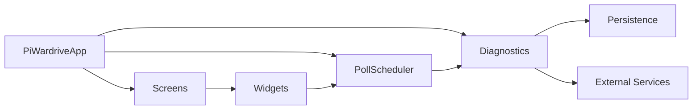
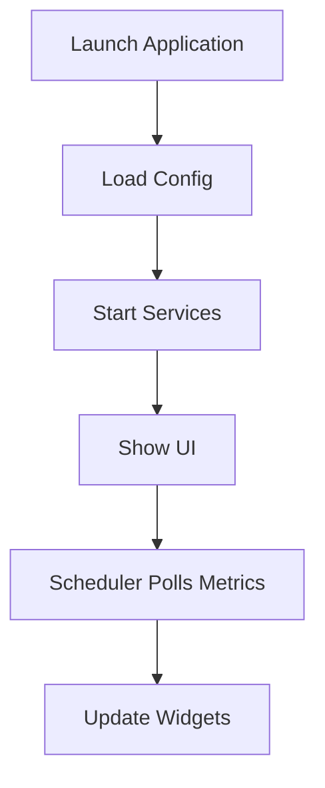
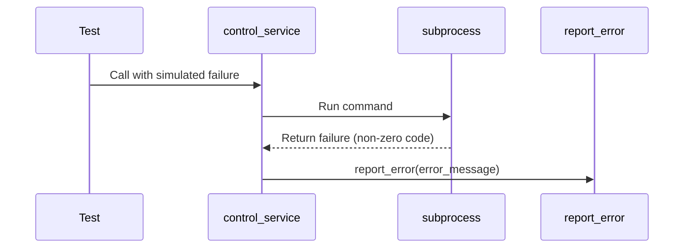

# PiWardrive

PiWardrive is a headless Raspberry Pi 5 application that combines war-driving tools (Kismet & BetterCAP) with an interactive Kivy/KivyMD touchscreen interface. It provides real-time mapping of Wi‑Fi access points, GPS tracking, system/network diagnostics, and service controls—all without an X server.
A lightweight SIGINT suite for command-line scanning lives under `sigint_suite/`.

For a consolidated overview of all available documentation see
**REFERENCE.md** in the repository root.

## Architecture Overview



The scheduler drives periodic tasks while diagnostics records system health.
Screens host smaller widgets that render metrics on the dashboard. External
services like Kismet and BetterCAP are controlled via helper functions.

## Features

* **Interactive Map**: Online/offline map tiles, AP overlays, long-press context menus.
* **Real‑time Metrics**: CPU, memory, disk I/O, GPS fix quality, RSSI, handshake counts.
* **Split View**: Simultaneous map + compact metrics panel.
* **Console & Dashboard**: Tail logs and a drag‑and‑drop widget dashboard with persistent layouts.
* **Service Management**: Start/stop and configure Kismet & BetterCAP from the GUI.
* **Offline Support**: Toggle MBTiles stored under `/mnt/ssd/tiles/`, prefetch visible regions and purge old tiles to stay within the cache limit.
* **Diagnostic Tools**: Generate system reports and run connectivity tests.
* **Automatic Log Rotation**: Periodically rotate logs like `/var/log/syslog` and
  compress archives.
* **Structured Logging**: Application events recorded as JSON under `~/.config/piwardrive/app.log`.
* **Disk SMART Check**: Periodically query SMART status for `/mnt/ssd`.
* **Async Metrics**: Wi‑Fi data and handshake counts fetched concurrently.
* **Historical Records**: Wi‑Fi and Bluetooth observations stored in SQLite for
  later analysis.
* **Optional Profiling**: Set `PW_PROFILE=1` to log performance stats on exit.
  Use `PW_PROFILE_CALLGRIND=/tmp/out.callgrind` to export callgrind data for
  analysis in KCachegrind.
* **Health Monitoring**: Background widget shows service status, disk usage and network connectivity.
* **Battery Widget**: Optional dashboard tile showing battery percentage if available.
* **Persistent GPSD Client**: Keeps a socket open to `gpsd` for faster updates.
* **Unified Error Reporting**: Consistent alerts and logs when operations fail.
* **Access Control**: Service commands require `PW_ADMIN_PASSWORD` or will
  prompt for a password interactively.
* **Encrypted Secrets**: Passwords stored as PBKDF2 hashes.
* **Env Overrides**: configure any option via `PW_<KEY>` environment variables.
* **Configuration Profiles**: maintain multiple configs under `~/.config/piwardrive/profiles`.
* **SIGINT Suite**: command-line scanning scripts live in `sigint_suite/`.
  Scan timeouts can be tuned via environment variables such as
  `WIFI_SCAN_TIMEOUT` or `BLUETOOTH_SCAN_TIMEOUT` without touching code.

## Hardware Prerequisites

* **Raspberry Pi 5** (16 GB RAM)
* **7" HDMI + USB touch screen**, `/dev/input/event2`
* **SSD** mounted at `/mnt/ssd` (fstab `nofail`)
* **GPS dongle** on `/dev/ttyACM0` (managed by `gpsd`)
* **Wi‑Fi adapter** compatible with monitor mode

## Prerequisites

* **OS**: Raspberry Pi OS Bookworm (or Bullseye backports)
* **Python**: 3.10 or later (virtualenv under `gui-env/`)
* **Kivy**: 2.3.1
* **KivyMD**: 1.1.1
* **Additional Python libs**: see `requirements.txt`
* **System Packages**: `kismet`, `gpsd`, `bettercap`, `evtest`, `git`, `build-essential`, `cmake`

## Installation

You can automate the basic setup by running ``scripts/quickstart.sh`` from the
repository root. It installs the required system packages, creates ``gui-env/``
and installs the Python dependencies. The manual steps are listed below.

1. **Install system packages** (Raspberry Pi OS)::

      sudo apt update && sudo apt install -y \
          git build-essential cmake kismet bettercap gpsd evtest python3-venv

2. **Clone the repo**::

      git clone https://github.com/TRASHYTALK/piwardrive.git
      cd piwardrive

3. **Create and activate a virtual environment**::

      python3 -m venv gui-env
      source gui-env/bin/activate

4. **Install Python dependencies**::

      pip install -r requirements.txt
      # confirm the pinned web framework versions
      pip install pydantic==2.11.7 fastapi==0.115.12
      pip install .

5. **Allow DBus service control**: create a ``polkit`` rule granting ``org.freedesktop.systemd1.manage-units`` to your user.

6. **Compile the C extensions** (``ckml`` and ``cgeom``)::


      pip install build
      python -m build
      pip install dist/*.whl

   See ``docs/ckml_build.rst`` for more detail.

7. **Configure fstab** (optional)::

      /dev/sda1  /mnt/ssd  ext4  defaults,nofail  0  2

For detailed instructions and troubleshooting steps see ``docs/installation.rst``.
## Docker

Build an image using the provided `Dockerfile`:
```bash
docker build -t piwardrive .
```
Run the app:
```bash
docker run --device=/dev/ttyUSB0 --rm piwardrive
```
For tests:
```bash
docker-compose run --rm test
```


## Configuration

* **KV File**: `kv/main.kv` defines all screen layouts. Ensure it matches `main.py` IDs.
* **Config File**: `~/.config/piwardrive/config.json` persists settings between runs.
* **Profiles**: alternate configs live in `~/.config/piwardrive/profiles`.
* **Env Overrides**: configure any option via `PW_<KEY>` variables.
  Common examples:
  * `PW_MAP_POLL_GPS=5` – poll gpsd every 5s when moving
  * `PW_MAP_POLL_GPS_MAX=30` – maximum delay while stationary
  * `PW_MAP_POLL_APS=30` – override the AP polling interval
  * `PW_MAP_POLL_BT=15` – Bluetooth scan interval
  * `PW_MAP_SHOW_BT=1` – display Bluetooth markers
  * `PW_WIDGET_BATTERY_STATUS=1` – enable battery widget
  * `PW_HEALTH_POLL_INTERVAL=5` – diagnostic poll rate
  * `PW_PROFILE_NAME=car_rig` – load the `car_rig` profile
  * `PW_API_PASSWORD_HASH=<hash>` – protect HTTP API endpoints
  * `PW_ADMIN_PASSWORD=<pass>` – enables privileged service actions
  * `PW_DB_PATH=/tmp/my.db` – location of the SQLite database
  See [docs/configuration.rst](docs/configuration.rst) for all settings.
* **GPS Polling**: `map_poll_gps` is the fastest interval while
  `map_poll_gps_max` sets the slowest interval when stationary.
* **Validation**: values are checked on load and invalid settings raise errors.
* **BetterCAP Caplet**: `/usr/local/etc/bettercap/alfa.cap`
* **Kismet Config**: `/usr/local/etc/kismet_site.conf`
* **Systemd Units**:

  * `kismet.service`
  * `bettercap.service`
  * (Optional) `piwardrive.service` to autostart the app.
* **Log Rotation**: rotate files like `/var/log/syslog` every `log_rotate_interval` seconds, compressing each archive and keeping `log_rotate_archives` backups.
* **Health Poll Interval**: adjust `health_poll_interval` to control how often the monitor collects metrics.

## Running the App

```bash
cd ~/piwardrive
activate gui-env/bin/activate
python main.py
```

* **No X Server**: The app renders directly to DRM/framebuffer.
* **Touch Events**: Mapped via SDL2; verify with `evtest /dev/input/event2`.

### Operational Workflow



The configuration is loaded, optional services are started and the scheduler
begins polling metrics that feed the widgets shown on screen.

## Mobile Builds

Build scripts for Android and iOS are provided. Ensure the prerequisites
listed in [docs/mobile_build.rst](docs/mobile_build.rst) are installed and
run one of:

```bash
./scripts/build_android.sh  # Android APK
./scripts/build_ios.sh      # iOS project
```

## Screen Overview

* **Map**: interactive map with GPS and access point overlays.
* **Stats**: detailed system and network metrics.
* **Split**: two-pane view with the map and a metrics column.
* **Console**: tail of Kismet and BetterCAP logs.
* **Settings**: built-in configuration editor for adjusting preferences.
* **Dashboard**: empty workspace for custom widgets.


## Usage

* **Tabs**: Swipe or tap top buttons to switch between Map, Stats, Split, Console, Settings, Dashboard.
* **Map Gestures**: Single-finger long‑press for context; drag to pan; pinch to zoom.
* **Context Menu**: Save waypoints, load GPX/KML tracks and measure distances.
* **Geofences**: Register polygons with ``add_geofence`` to trigger callbacks when entering or leaving an area.

### Geofences

Call ``add_geofence(name, polygon, on_enter=None, on_exit=None)`` to register a
polygon. ``on_enter`` and ``on_exit`` callbacks fire when the GPS location
crosses the polygon boundary. Tests ``test_geofence_clustering.py`` and
``test_geofence_handling.py`` contain usage examples.

## Widget Plugins

PiWardrive searches ``~/.config/piwardrive/plugins`` for additional widget
modules on startup. Any subclasses of ``DashboardWidget`` defined in that
directory are imported automatically and exposed from the :mod:`widgets`
package. A minimal plugin looks like::

    # ~/.config/piwardrive/plugins/my_widget.py
    from widgets.base import DashboardWidget

    class ExtraWidget(DashboardWidget):
        pass

Once the file is created, ``ExtraWidget`` can be added to the dashboard like any
other built-in widget.

Compiled extensions built with PyO3 or Cython are supported as well. Place the
resulting ``.so`` (or ``.pyd`` on Windows) in the plugin directory or within a
package. Ensure the extension is built against the same Python version that
runs PiWardrive and that ``build-essential`` and the Python development headers
are installed.

### Available Hooks

Every plugin widget must provide an ``update()`` method. The
``PollScheduler`` calls this hook every ``update_interval`` seconds and it may
either execute synchronously or return a coroutine for asynchronous work.
Widgets typically create their UI in ``__init__`` and can override
``on_size`` to update the draggable area when resized.

## Error Handling
The application reports errors consistently using `utils.report_error`. The sequence below illustrates how
`control_service` surfaces failures:



`report_error` logs the message and shows a dialog if the GUI is running.
Error messages are prefixed with codes like `[E001]` to aid troubleshooting.

## Documentation & Tests

The Sphinx documentation under [docs/](docs/) provides detailed guides for each component of the application.

* [installation](docs/installation.rst) – step by step setup
* [configuration](docs/configuration.rst) – all runtime options
* [widgets](docs/widgets.rst) – reference for each dashboard widget
* [architecture](docs/architecture.rst) – system overview diagrams
* [function_flows](docs/function_flows.rst) – diagrams of key functions

Run `pytest` to execute the test suite and use `flake8` and `mypy` to lint and type-check the codebase.
Tests can also be executed inside the Docker image provided in this repository:

```bash
docker compose build
docker compose run --rm tests
```

## Module Reference

Each module below has a focused responsibility within the application.  The
summaries link to their source files for quick reference.

### `main.py`
Defines `PiWardriveApp` and manages initialization, screen setup, service
control, auto-saving configuration and cleanup.

### `utils.py`
Utility helpers that handle error formatting, async task execution, safe
requests, and system metrics. Errors are reported uniformly via
`report_error`.

### `diagnostics.py`
Collects system metrics and rotates log files. `HealthMonitor` periodically
gathers data and stores it in SQLite, catching and logging exceptions during
polling.

### `persistence.py`
Defines `HealthRecord` and `AppState` dataclasses and provides async functions
for saving and loading them via a small SQLite database. Connections are cached
per event loop so the schema is initialised only once.

### `scheduler.py`
Supplies `PollScheduler` and `AsyncScheduler` classes for periodic callbacks.
Both versions log exceptions while keeping tasks alive.

### `export.py`
Filters and exports recorded access-point data in CSV, JSON, GPX, or KML
formats, raising `ValueError` for unsupported formats.

### `analysis.py`
Computes average health statistics and can plot CPU temperature, optionally
using pandas and Plotly when available.

### `scripts/health_export.py`
Exports recent `HealthRecord` rows in CSV or JSON format.

### `scripts/health_import.py`
Imports `HealthRecord` data from a JSON or CSV file back into the tracking database.

### `gpsd_client.py`
Maintains a persistent connection to `gpsd`, gracefully handling connection
failures and returning `None` on errors.

### `security.py`
Provides path sanitization, service name validation, password hashing and
verification, plus simple encryption helpers.

### `logconfig.py`
Configures JSON-formatted logging, writing to `~/.config/piwardrive/app.log`.

### `localization.py`
Offers a lightweight translation mechanism that caches parsed locale files so
switching languages doesn't reread JSON from disk. Missing keys fall back to the
original text.

### `service.py`
Exposes recent health records and widget metrics over FastAPI, with optional
HTTP basic authentication and log retrieval endpoints.

### `exception_handler.py`
Installs a Kivy exception handler that logs uncaught exceptions instead of
crashing the GUI.

### `di.py`
Implements a minimal dependency-injection container used to manage shared
services.

## React Web UI

An optional React application lives under `webui/`. It consumes the API endpoints provided by `service.py`.

```bash
cd webui
npm install
npm run build  # production build
npm run dev    # start Vite dev server
```

The dev server proxies API requests to `http://localhost:8000`. Set `PW_API_PASSWORD_HASH` to require a password for the backend routes.

## R Integration

PiWardrive can optionally analyze health metrics using R. The helper
[scripts/health_summary.R](scripts/health_summary.R) reads a CSV or JSON file of
`HealthRecord` rows, returning average CPU temperature, CPU usage, memory usage
and disk usage. It may also generate a CPU temperature plot. Call
`r_integration.health_summary` from Python to run the R code via `rpy2`.

Install the dependencies with:

```bash
pip install rpy2
sudo apt install r-base
Rscript -e "install.packages(c('ggplot2','jsonlite'), repos='https://cloud.r-project.org')"
```

Other optional features rely on additional Python packages:

```bash
pip install pandas orjson pyprof2calltree
```

## Contributing

Install project and development dependencies and run the tests locally with:

```bash
pip install -r requirements.txt
pip install -r requirements-dev.txt
pip install .
pytest
```
Alternatively run the suite in Docker:

```bash
docker compose run --rm tests
```

The `requirements-dev.txt` file includes tools like `flake8`, `mypy` and
`pytest` along with runtime dependencies required by the tests such as
`aiosqlite`, `psutil`, `pydantic`, `fastapi` and `httpx`.

Cyclomatic complexity is also checked in CI. The workflow runs
`scripts/check_complexity.py`, which fails if any function is rated `D` or
worse by `radon`. Run `radon cc -n D -s .` locally to verify your changes before
opening a pull request.

Install pre-commit hooks with:
```bash
pre-commit install
```
Please ensure you comply with all local laws and obtain proper authorization before conducting any wireless or Bluetooth scans. The authors are not responsible for any misuse of this software.
