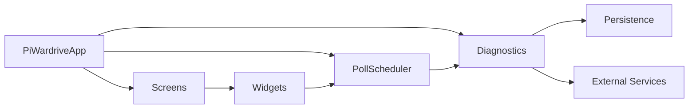
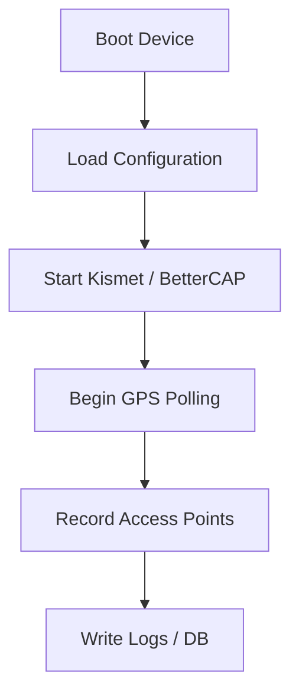
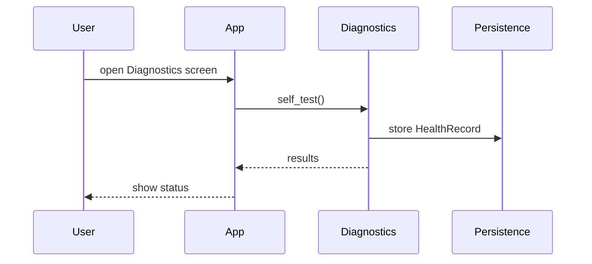
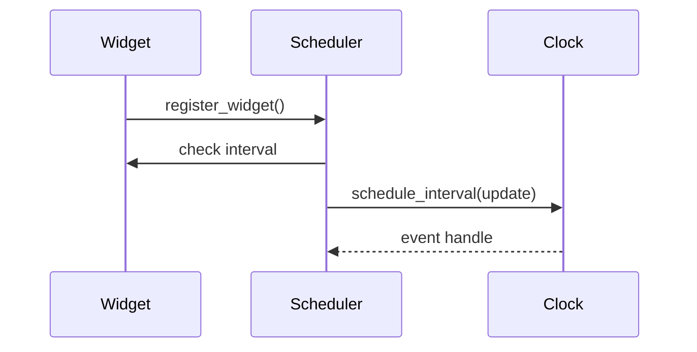

# PiWardrive

PiWardrive is a headless mapping and diagnostic suite for Raspberry Pi 5. It merges war-driving tools such as Kismet and BetterCAP with a touch-friendly interface built on Kivy/KivyMD. The project runs without an X server and includes a command line SIGINT suite for scanning.

For a full index of guides see [REFERENCE.md](REFERENCE.md) and the `docs/` directory.

## Architecture Overview



## Data Inputs
- Kismet
- Bettercap
- GPSD
- SDR
- Orientation sensors (gyroscope, accelerometer, OBD‑II adapter)
  - ``dbus`` + ``iio-sensor-proxy`` or an external MPU‑6050 are optional;
    the app falls back gracefully when absent
  - Wi-Fi scans record the current antenna heading along with RSSI when
    orientation data is available


## U/I Features
- Service controls for Kismet and BetterCAP
- Interactive map with offline tile prefetch and rotation
- Predictive route tile caching
- Real-time CPU, memory and network metrics
- Drag-and-drop dashboard widgets
- Vector tile renderer and track playback
- Drone-based mapping mode
- Geofencing and cached map tiles
- Status service with React web UI


## Data Handling
- Multi-format exports (GPX/KML/CSV/JSON/GeoJSON/Shapefile)
- Diagnostics and log rotation
- Remote database sync (`remote_sync.py`) with a central aggregation service
  for combined statistics and map overlays
- Observations stored in SQLite for later analysis
- CLI SIGINT tools under `sigint_suite/` (set `SIGINT_DEBUG=1` for debug logs)
  
The scheduler drives periodic tasks while diagnostics records system health. Screens host widgets that show metrics on the dashboard, while helper routines control external services like Kismet and BetterCAP.

### Scanning and Logging



### Diagnostics Flow



### Scheduler Hooks



Schedulers expose basic metrics via ``get_metrics()`` including the next
scheduled run time and duration of the last callback execution. These values
aid troubleshooting periodic jobs during development.

## Quick Start

### Hardware
- Raspberry Pi 5 with 7" touchscreen
- SSD mounted at `/mnt/ssd`
- GPS dongle on `/dev/ttyACM0`
- External Wi-Fi adapter (monitor mode)

### Software
- Raspberry Pi OS Bookworm or Bullseye
- Python 3.10+
- System packages: `kismet`, `gpsd`, `bettercap`, `evtest`, `git`, `build-essential`, `cmake`

### Installation

```bash
git clone https://github.com/TRASHYTALK/piwardrive.git
cd piwardrive
python3 -m venv gui-env
source gui-env/bin/activate
pip install -r requirements.txt
pip install .
```

You can run `./scripts/quickstart.sh` to install system packages and create the virtual environment automatically.

#### Optional Dependencies

Some components rely on additional Python packages. Install them only if you need the corresponding feature:

- `dbus-fast` – asynchronous service control via D-Bus; otherwise `systemctl` is used.
- `dbus-python` or `mpu6050` – provides orientation data from `iio-sensor-proxy` or an external MPU‑6050 sensor.
- `bleak` – enables Bluetooth scanning on the map and in the `sigint_suite` tools.
- `rpy2` – required for generating daily health summaries with R.
- `pandas`, `orjson`, `pyprof2calltree` – used by advanced analytics and profiling helpers.

Activate the virtual environment and run `pip install <package>` for any that apply.

### Running

```bash
source gui-env/bin/activate
python main.py
```

The UI renders directly on the framebuffer so no X server is required.

### Optional C Extensions

Two small C modules, `ckml` and `cgeom`, speed up geometry and KML parsing. They
are optional – pure Python fallbacks are used if compilation fails – but the
extensions provide a noticeable performance boost. Build them from the repository
root using `python -m build` and then install the generated wheel:

```bash
pip install build
python -m build
pip install dist/*.whl
```

See `docs/ckml_build.rst` for troubleshooting tips.

### Docker

```bash
docker build -t piwardrive .
docker run --device=/dev/ttyUSB0 --rm piwardrive
```

### Automated vs Manual Tasks

#### Automated Aspects

* **Health Monitoring & Log Rotation** – `HealthMonitor` polls `diagnostics.self_test()` on a schedule while `rotate_logs` trims old log files automatically.
* **Tile Cache Maintenance** – stale tiles are purged and MBTiles databases vacuumed at intervals defined by `tile_maintenance_interval`.
* **Configuration Reloads** – a filesystem watcher detects updates to `config.json` and applies them along with any `PW_` overrides without restarting.
* **Plugin Discovery** – new widgets placed under `~/.config/piwardrive/plugins` are loaded automatically on startup.

#### Manual Steps

* **Installation** – run `scripts/quickstart.sh` or follow the manual steps to clone the repo, create a virtualenv and install dependencies.
* **Launching the App** – activate the environment and start PiWardrive with `python main.py` or enable `piwardrive.service` to start on boot.
* **Running the Status API** – start the FastAPI service manually with `python -m service` to expose remote metrics.
* **Map Tile Prefetch** – use `piwardrive-prefetch` to download map tiles without the GUI.
* **Syncing Data** – set `remote_sync_url` in `~/.config/piwardrive/config.json`
  and trigger uploads via `/sync` or call
  `remote_sync.sync_database_to_server` directly.
* **Offline Vector Tile Customizer** – `piwardrive-mbtiles` builds and styles offline tile sets.
* **Configuration Wizard** – run `setup_wizard.py` to interactively create profiles or edit `~/.config/piwardrive/config.json` by hand.


## Mobile Builds

Scripts under `scripts/` create Android or iOS builds:

```bash
./scripts/build_android.sh  # Android APK
./scripts/build_ios.sh      # iOS project
```

## Configuration

Settings persist in `~/.config/piwardrive/config.json`. Profiles under
`~/.config/piwardrive/profiles` can store alternate configurations and may be
selected via the `PW_PROFILE_NAME` environment variable. Environment variables
prefixed with `PW_` override any option. See `docs/configuration.rst` and
`docs/environment.rst` for a full list.

## Additional Documentation

Comprehensive guides and API references live in the `docs/` directory. Run `make html` there to build the Sphinx site. High level summaries are collected in [REFERENCE.md](REFERENCE.md).

## Contributing

Install the development dependencies and run the tests:

```bash
pip install -r requirements.txt
pip install -r requirements-dev.txt
pre-commit run --all-files
pytest
```

Docker helpers are provided:

```bash
docker compose run --rm tests
```

## Legal Notice

Ensure all wireless and Bluetooth scans comply with local laws and have proper authorization. The authors are not responsible for misuse of this software.
