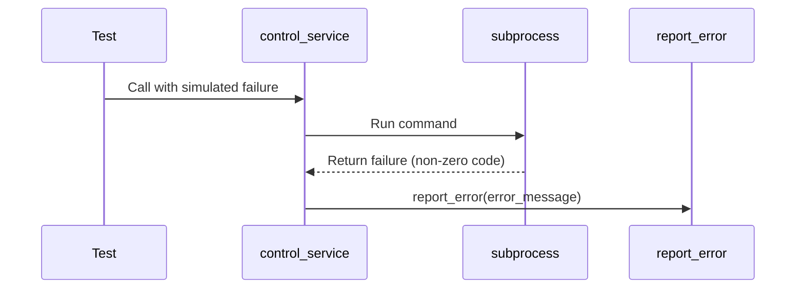

# PiWardrive

PiWardrive is a headless Raspberry Pi 5 application that combines war-driving tools (Kismet & BetterCAP) with an interactive Kivy/KivyMD touchscreen interface. It provides real-time mapping of Wi‑Fi access points, GPS tracking, system/network diagnostics, and service controls—all without an X server.

## Features

* **Interactive Map**: Online/offline map tiles, AP overlays, long-press context menus.
* **Real‑time Metrics**: CPU, memory, disk I/O, GPS fix quality, RSSI, handshake counts.
* **Split View**: Simultaneous map + compact metrics panel.
* **Console & Dashboard**: Tail logs and a drag‑and‑drop widget dashboard with persistent layouts.
* **Service Management**: Start/stop and configure Kismet & BetterCAP from the GUI.
* **Offline Support**: Toggle MBTiles stored under `/mnt/ssd/tiles/`.
* **Diagnostic Tools**: Generate system reports and run connectivity tests.
* **Automatic Log Rotation**: Periodically rotate logs like `/var/log/syslog`.
* **Structured Logging**: Application events recorded as JSON under `~/.config/piwardrive/app.log`.
* **Disk SMART Check**: Periodically query SMART status for `/mnt/ssd`.
* **Async Metrics**: Wi‑Fi data and handshake counts fetched concurrently.
* **Optional Profiling**: Set `PW_PROFILE=1` to log performance stats on exit.
* **Health Monitoring**: Background widget shows service status, disk usage and network connectivity.
* **Battery Widget**: Optional dashboard tile showing battery percentage if available.
* **Unified Error Reporting**: Consistent alerts and logs when operations fail.
* **Env Overrides**: configure any option via `PW_<KEY>` environment variables.

## Hardware Prerequisites

* **Raspberry Pi 5** (16 GB RAM)
* **7" HDMI + USB touch screen**, `/dev/input/event2`
* **SSD** mounted at `/mnt/ssd` (fstab `nofail`)
* **GPS dongle** on `/dev/ttyACM0` (managed by `gpsd`)
* **Wi‑Fi adapter** compatible with monitor mode

## Prerequisites

* **OS**: Raspberry Pi OS Bookworm (or Bullseye backports)
* **Python**: 3.11.2 (virtualenv under `gui-env/`)
* **Kivy**: 2.3.1
* **KivyMD**: 1.1.1
* **Additional Python libs**: see `requirements.txt`
* **System Packages**: `kismet`, `gpsd`, `bettercap`, `evtest`, `git`, `build-essential`, `cmake`

## Installation

1. **Clone the repo**:

   ```bash
   git clone https://github.com/TRASHYTALK/piwardrive.git
   ```

2. **Install Python dependencies**:

   ```bash
   pip install -r requirements.txt
   ```

3. **Configure fstab** (optional):

   ```bash
   /dev/sda1  /mnt/ssd  ext4  defaults,nofail  0  2
   ```

## Configuration

* **KV File**: `kv/main.kv` defines all screen layouts. Ensure it matches `main.py` IDs.
* **Config File**: `~/.config/piwardrive/config.json` persists settings between runs.
* **Env Overrides**: use environment variables like `PW_MAP_POLL_GPS=5`.
* **Validation**: values are checked on load and invalid settings raise errors.
* **BetterCAP Caplet**: `/usr/local/etc/bettercap/alfa.cap`
* **Kismet Config**: `/usr/local/etc/kismet_site.conf`
* **Systemd Units**:

  * `kismet.service`
  * `bettercap.service`
  * (Optional) `piwardrive.service` to autostart the app.
* **Log Rotation**: rotate files like `/var/log/syslog` every `log_rotate_interval` seconds and keep `log_rotate_archives` backups.
* **Health Poll Interval**: adjust `health_poll_interval` to control how often the monitor collects metrics.

## Running the App

```bash
cd ~/piwardrive
activate gui-env/bin/activate
python main.py
```

* **No X Server**: The app renders directly to DRM/framebuffer.
* **Touch Events**: Mapped via SDL2; verify with `evtest /dev/input/event2`.
## Screen Overview

* **Map**: interactive map with GPS and access point overlays.
* **Stats**: detailed system and network metrics.
* **Split**: two-pane view with the map and a metrics column.
* **Console**: tail of Kismet and BetterCAP logs.
* **Settings**: toggle services and theme (placeholder for persistence).
* **Dashboard**: empty workspace for custom widgets.


## Usage

* **Tabs**: Swipe or tap top buttons to switch between Map, Stats, Split, Console, Settings, Dashboard.
* **Map Gestures**: Single-finger long‑press for context; drag to pan; pinch to zoom.
* **Context Menu**: Save waypoints, load GPX/KML tracks and measure distances.

## Error Handling
The application reports errors consistently using `utils.report_error`. The sequence below illustrates how
`control_service` surfaces failures:



`report_error` logs the message and shows a dialog if the GUI is running.

## Documentation & Tests

See [docs/](docs/) for configuration guides and widget details. Run `pytest` to execute the test suite and
use `flake8` and `mypy` to lint and type-check the codebase.

## Contributing

Install development dependencies with:

```bash
pip install -r requirements-dev.txt
```

The `requirements-dev.txt` file lists `flake8`, `mypy` and `pytest` which are
used to lint, type-check and test the project.
