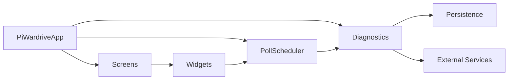
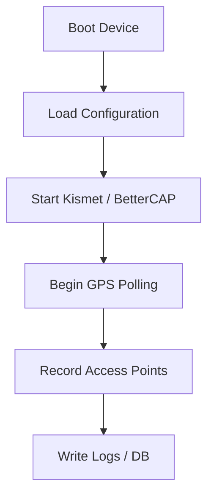
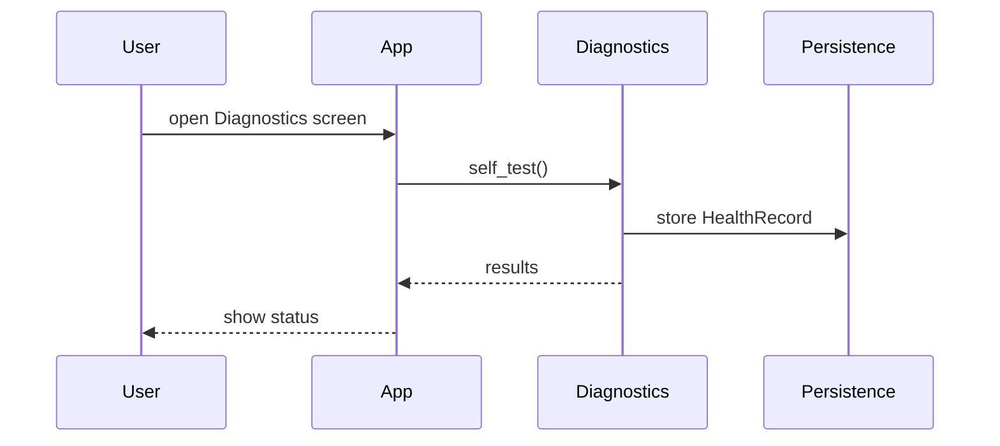
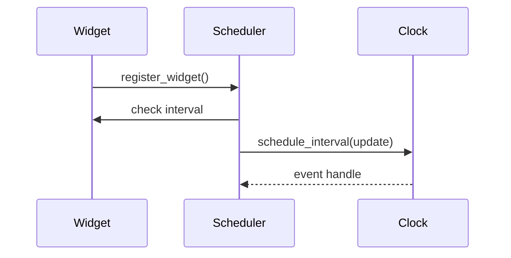

# PiWardrive

PiWardrive is a headless mapping and diagnostic suite for Raspberry Pi 5. It merges war-driving tools such as Kismet and BetterCAP with a touch-friendly interface built on Kivy/KivyMD. The project runs without an X server and includes a command line SIGINT suite for scanning. A browser-based dashboard is also available when the optional React frontend is built.

For a full index of guides see [REFERENCE.md](REFERENCE.md) and the `docs/` directory.

## Architecture Overview



## Project Layout

- All source code resides under `src/piwardrive/`.
- Command-line helper scripts live in the top-level `scripts/` directory.
- Import from `piwardrive` directly when running tools or tests.

## Data Inputs
- Kismet
- Bettercap
- GPSD
- SDR
- Orientation sensors (gyroscope, accelerometer, OBD‑II adapter)
  - ``dbus`` + ``iio-sensor-proxy`` or an external MPU‑6050 are optional;
    the app falls back gracefully when absent
  - Wi-Fi scans record the current antenna heading along with RSSI when
    orientation data is available


## U/I Features
- Service controls for Kismet and BetterCAP
- Interactive map with offline tile prefetch and rotation
- Predictive route tile caching
- Real-time CPU, memory and network metrics
- Drag-and-drop dashboard widgets
- Vector tile renderer and track playback
- Heatmap overlay on the map screen
- Vector tile customizer in the web UI
- Drone-based mapping mode
- Geofencing and cached map tiles
- Status service with React web UI
- Plugin widgets shown in the web UI
- Offline-capable PWA frontend


## Data Handling
- Multi-format exports (GPX/KML/CSV/JSON/GeoJSON/Shapefile)
- Diagnostics and log rotation
- Remote database sync (`remote_sync.py`) with a central aggregation service
  for combined statistics and map overlays
- Observations stored in SQLite for later analysis
- CLI SIGINT tools under `src/piwardrive/sigint_suite/` (set `SIGINT_DEBUG=1` for debug logs)
  
The scheduler drives periodic tasks while diagnostics records system health. Screens host widgets that show metrics on the dashboard, while helper routines control external services like Kismet and BetterCAP.

### Scanning and Logging



### Diagnostics Flow



### Scheduler Hooks



Schedulers expose basic metrics via ``get_metrics()`` including the next
scheduled run time and duration of the last callback execution. These values
aid troubleshooting periodic jobs during development.

## Quick Start

### Hardware
- Raspberry Pi 5 with 7" touchscreen
- SSD mounted at `/mnt/ssd`
- GPS dongle on `/dev/ttyACM0`
- External Wi-Fi adapter (monitor mode)

### Software
- Raspberry Pi OS Bookworm or Bullseye
- Python 3.10+
- System packages: `kismet`, `gpsd`, `bettercap`, `evtest`, `git`, `build-essential`, `cmake`

### Installation

```bash
git clone git@github.com:Trashytalk/piwardrive.git
cd piwardrive
python3 -m venv gui-env
source gui-env/bin/activate
pip install -r requirements.txt
pip install .
sudo apt update
sudo apt install -y r-base r-base-dev

```

You can run `scripts/quickstart.sh` to install system packages and create the virtual environment automatically.

#### Step-by-Step Setup

1. Flash Raspberry Pi OS (Lite recommended) to an SD card and boot the Pi.
2. Install required system packages:

   ```bash
   sudo apt update && sudo apt install -y \
       git build-essential cmake kismet bettercap gpsd evtest python3-venv
   ```
3. Clone the repository and switch into the project directory:

   ```bash
   git clone git@github.com:Trashytalk/piwardrive.git
   cd piwardrive
   ```
4. Create and activate the virtual environment:

   ```bash
   python3 -m venv gui-env
   source gui-env/bin/activate
   ```
5. Install Python dependencies and the project itself:

   ```bash
   pip install -r requirements.txt
   pip install .
   ```
6. (Optional) mount an external SSD by editing `/etc/fstab`::

   /dev/sda1  /mnt/ssd  ext4  defaults,nofail  0  2

7. Enable `kismet`, `bettercap` and `gpsd` to start on boot:

   ```bash
   sudo systemctl enable kismet bettercap gpsd
   ```
8. (Optional) copy `examples/piwardrive.service` into `/etc/systemd/system/` and enable it to run the API on boot:

   ```bash
   sudo cp examples/piwardrive.service /etc/systemd/system/
   sudo systemctl enable --now piwardrive.service
   ```
9. Start the application manually if the service is not enabled:

   ```bash
   piwardrive-service
   ```

#### Optional Dependencies

Some components rely on additional Python packages. Install them only if you need the corresponding feature:

- `dbus-fast` – asynchronous service control via D-Bus; otherwise `systemctl` is used.
- `dbus-python` or `mpu6050` – provides orientation data from `iio-sensor-proxy` or an external MPU‑6050 sensor.
- `bleak` – enables Bluetooth scanning on the map and in the `piwardrive.sigint_suite` tools.
- `rpy2` – required for generating daily health summaries with R.
- `pandas`, `orjson`, `pyprof2calltree` – used by advanced analytics and profiling helpers.

Activate the virtual environment and run `pip install <package>` for any that apply.

## Installation Prerequisites & Setup

Follow these steps to configure the Python and React development environment.

1. **Enter your project directory**
   ```bash
   cd ~/piwardrive
   ```

2. **Install system prerequisites (run once):**
   ```bash
   sudo apt update
   sudo apt install -y \
     build-essential pkg-config meson ninja-build \
     libdbus-1-dev libdbus-glib-1-dev \
     r-base r-base-dev libtirpc-dev \
     python3-dev python3-venv \
     nodejs npm
   ```

3. **Create and activate a Python venv**
   ```bash
   python3 -m venv venv
   source venv/bin/activate
   ```

4. **Upgrade pip/setuptools and install Python deps**
   ```bash
   pip install --upgrade pip setuptools wheel meson ninja
   pip install -r requirements.txt
   ```

5. **Build the React frontend**
   ```bash
   cd webui
   npm install         # only on first run or when package.json changes
   npm run build
   cd ..
   ```

6. **Install the package in editable mode**
   ```bash
   pip install --editable .
   ```

7. **Start the ASGI server**
   ```bash
   uvicorn piwardrive.webui_server:app --reload
   ```

8. **Verify**
   ```bash
   # Visit the React UI
   http://127.0.0.1:8000/

   # Check the API endpoint
   http://127.0.0.1:8000/api/status/cpu_history?limit=5
   ```

### Running

#### Web Interface

The primary GUI is a React dashboard served alongside the API. Node.js 18 or
newer is required for the build tools. From the repository root run:

```bash
cd webui
npm install
npm run build
cd ..
python -m piwardrive.webui_server
```
To autostart the dashboard on boot copy `examples/piwardrive-webui.service` into `/etc/systemd/system/` and enable it with `sudo systemctl enable --now piwardrive-webui.service`.


Alternatively serve `webui/dist` with any webserver while running
`piwardrive-service` for the API. During development you can run
`npm run dev` which starts a Vite server and proxies API requests to
`http://localhost:8000`.

This starts a FastAPI server on `http://0.0.0.0:8000` with the API under `/api`.
Launch Chromium in kiosk mode with the helper command:

```bash
piwardrive-kiosk
```
The command runs `piwardrive-webui` in the background and opens Chromium with
`--kiosk` pointing to the dashboard. Chromium must run inside a graphical
environment. Ensure an X server is available and ``$DISPLAY`` is set.
Headless setups can use ``Xvfb``.

#### Touch Interface (optional)

```bash
source gui-env/bin/activate
python -m piwardrive.main
```

The Kivy interface renders directly on the framebuffer so no X server is
required.

### Optional C Extensions

Two small C modules, `ckml` and `cgeom`, speed up geometry and KML parsing. They
are optional – pure Python fallbacks are used if compilation fails – but the
extensions provide a noticeable performance boost. Build them from the repository
root using `python -m build` and then install the generated wheel:

```bash
pip install build
python -m build
pip install dist/*.whl
```

See `docs/ckml_build.rst` for troubleshooting tips.

### Docker

```bash
docker build -t piwardrive .
docker run --device=/dev/ttyUSB0 --rm piwardrive
```

### Automated vs Manual Tasks

#### Automated Aspects

* **Health Monitoring & Log Rotation** – `HealthMonitor` polls `diagnostics.self_test()` on a schedule while `rotate_logs` trims old log files automatically.
* **Tile Cache Maintenance** – stale tiles are purged and MBTiles databases vacuumed at intervals defined by `tile_maintenance_interval`.
* **Configuration Reloads** – a filesystem watcher detects updates to `config.json` and applies them along with any `PW_` overrides without restarting.
* **Plugin Discovery** – new widgets placed under `~/.config/piwardrive/plugins` are loaded automatically on startup. The `/plugins` API route lists any discovered classes so you can verify custom widgets were detected.

#### Manual Steps

* **Installation** – run `scripts/quickstart.sh` or follow the manual steps to clone the repo, create a virtualenv and install dependencies.
* **Launching the App** – activate the environment and start PiWardrive with `python -m piwardrive.main`.
* **Systemd Service Setup** – copy `examples/piwardrive.service` to `/etc/systemd/system/` and enable it with `sudo systemctl enable --now piwardrive.service` to launch the backend on boot.
* **Running the Status API** – start the FastAPI service manually with `piwardrive-service` to expose remote metrics.
* **Browser Kiosk Mode** – build the React frontend (see above) and launch it with `piwardrive-kiosk` to start the server and open Chromium automatically.
* **Map Tile Prefetch** – use `piwardrive-prefetch` to download map tiles without the GUI.
* **Syncing Data** – set `remote_sync_url` (and optionally `remote_sync_interval`)
  in `~/.config/piwardrive/config.json` and trigger uploads via `/sync` or call
  `remote_sync.sync_database_to_server` directly.
* **Offline Vector Tile Customizer** – `piwardrive-mbtiles` builds and styles offline tile sets.
* **Configuration Wizard** – run `python -m piwardrive.setup_wizard` to interactively create profiles or edit `~/.config/piwardrive/config.json` by hand.


### Example systemd unit

```ini
[Unit]
Description=PiWardrive Backend Service
After=network.target

[Service]
Type=simple
User=pi
WorkingDirectory=/home/pi/piwardrive
ExecStart=/home/pi/piwardrive/gui-env/bin/piwardrive-service
Restart=on-failure

[Install]
WantedBy=multi-user.target
```

## Kiosk Setup on Pi OS Lite

1. **Install prerequisites**
   ```bash
   sudo apt update
   sudo apt install -y xserver-xorg xinit matchbox-window-manager chromium-browser
   ```

2. **Create `~/kiosk.sh`**
   ```bash
   #!/bin/sh
   xset -dpms
   xset s off
   matchbox-window-manager &
   chromium-browser --kiosk http://127.0.0.1:8000/
   ```

3. **Create `~/.xsession`**
   ```bash
   exec sh /home/pi/kiosk.sh
   ```

4. **Define `kiosk.service`**
   ```ini
   [Unit]
   Description=Chromium Kiosk
   After=graphical.target

   [Service]
   Type=simple
   User=pi
   Environment=DISPLAY=:0
   ExecStart=/usr/bin/startx

   [Install]
   WantedBy=multi-user.target
   ```

5. **(Optional) `piwardrive.service`**
   ```ini
   [Unit]
   Description=PiWardrive Backend
   After=network.target

   [Service]
   Type=simple
   User=pi
   WorkingDirectory=/home/pi/piwardrive
   ExecStart=/home/pi/piwardrive/venv/bin/uvicorn piwardrive.webui_server:app --reload
   Restart=on-failure

   [Install]
   WantedBy=multi-user.target
   ```

6. **Enable services and reboot**
   ```bash
   sudo systemctl enable kiosk.service
   sudo systemctl enable piwardrive.service  # optional
   sudo reboot
   ```

7. **Verification**
   After reboot, Chromium should launch automatically in full-screen kiosk mode displaying the PiWardrive dashboard. If it does not, check the service logs with `journalctl -u kiosk.service` and `journalctl -u piwardrive.service`.

## Mobile Builds

Scripts under `scripts/` create Android or iOS builds:

```bash
./scripts/build_android.sh  # Android APK
./scripts/build_ios.sh      # iOS project
```

## Configuration

Settings persist in `~/.config/piwardrive/config.json`. Profiles under
`~/.config/piwardrive/profiles` can store alternate configurations and may be
selected via the `PW_PROFILE_NAME` environment variable. Environment variables
prefixed with `PW_` override any option. See `docs/configuration.rst` and
`docs/environment.rst` for a full list.

## Additional Documentation

Comprehensive guides and API references live in the `docs/` directory. Run `make html` there to build the Sphinx site. High level summaries are collected in [REFERENCE.md](REFERENCE.md).

## Contributing

Install the development dependencies and run the tests:

```bash
pip install -r requirements.txt
pip install -r requirements-dev.txt
pre-commit run --all-files
pytest
```

`pre-commit` automatically installs packages listed in `requirements.txt`
and `requirements-dev.txt`, so hooks and tests run consistently.

Docker helpers are provided:

```bash
docker compose run --rm tests
```

## Legal Notice

Ensure all wireless and Bluetooth scans comply with local laws and have proper authorization. The authors are not responsible for misuse of this software.
