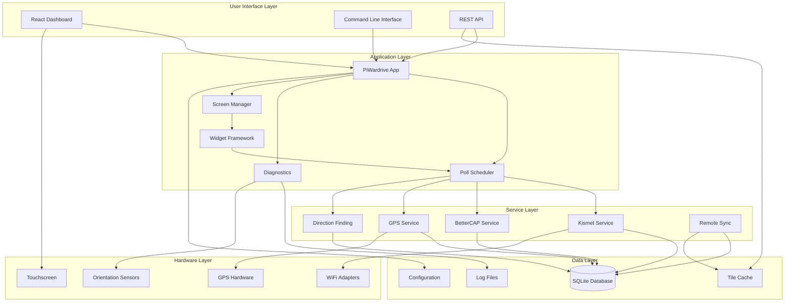
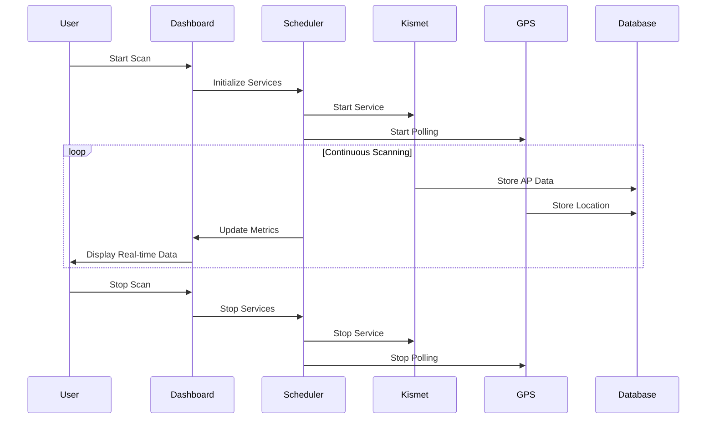
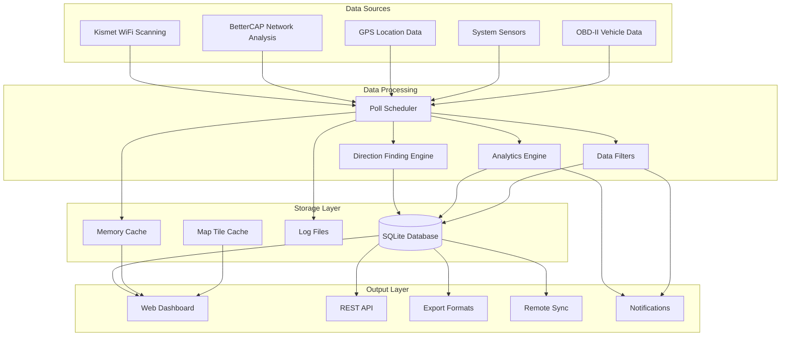
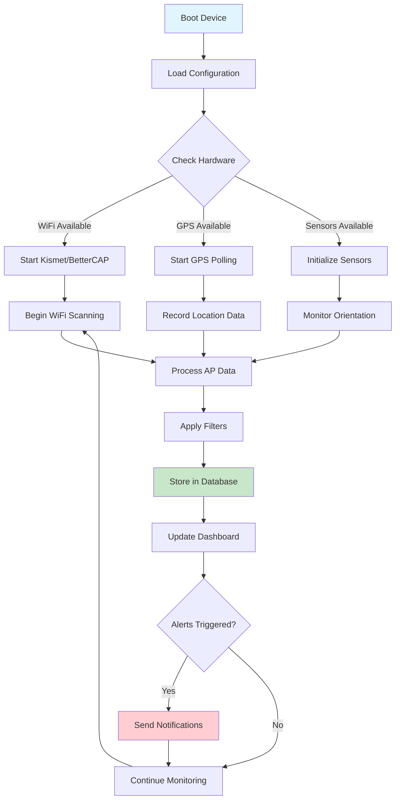
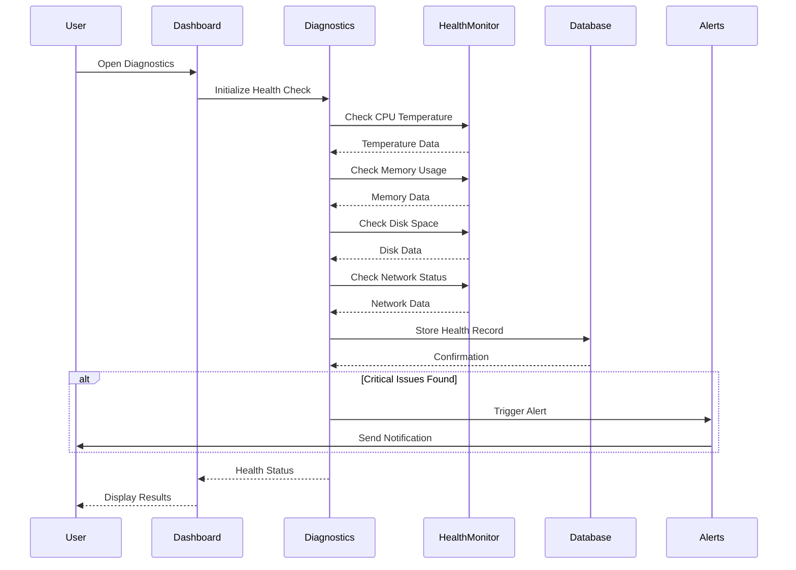
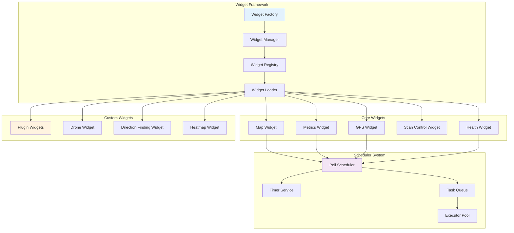
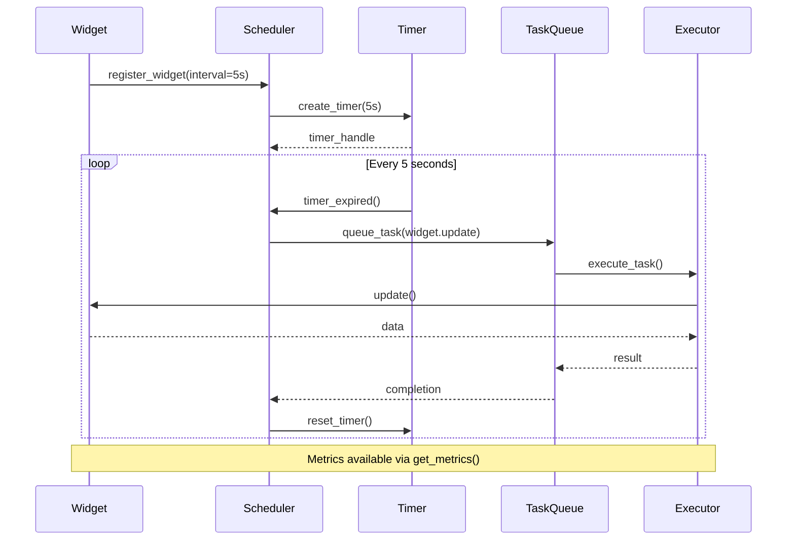
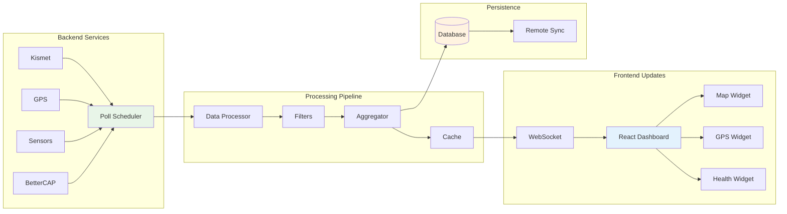

# PiWardrive

[](https://app.codecov.io/gh/TRASHYTALK/piwardrive?flags=backend)
[](https://app.codecov.io/gh/TRASHYTALK/piwardrive?flags=frontend)

PiWardrive is a headless mapping and diagnostic suite for Raspberry Pi 5. It merges war-driving tools such as Kismet and BetterCAP with a lightweight command line SIGINT suite for scanning. The primary interface is a browser-based dashboard built with React. Launch it after building the frontend with:

```bash
python -m piwardrive.webui_server
```

For a full index of guides see [REFERENCE.md](REFERENCE.md) and the `docs/` directory. Troubleshooting steps are summarized in the [FAQ](docs/faq.rst).

## Architecture Overview

### System Architecture



### Component Interaction Flow



## Project Layout

-   All source code resides under `src/piwardrive/`.
-   Command-line helper scripts live in the top-level `scripts/` directory.
-   Import from `piwardrive` directly when running tools or tests.

## Data Inputs

-   Kismet
-   Bettercap
-   GPSD
-   SDR
-   Orientation sensors (gyroscope, accelerometer, OBD‑II adapter)
    -   `dbus` + `iio-sensor-proxy` or an external MPU‑6050 are optional;
        the app falls back gracefully when absent
    -   Wi-Fi scans record the current antenna heading along with RSSI when
        orientation data is available

## U/I Features

-   Service controls for Kismet and BetterCAP
-   Interactive map with offline tile prefetch and rotation
-   Predictive route tile caching
-   Real-time CPU, memory and network metrics
-   Drag-and-drop dashboard widgets
-   Vector tile renderer and track playback
-   Heatmap overlay on the map screen
-   Vector tile customizer in the web UI
-   Drone-based mapping mode
-   Geofencing and cached map tiles
-   Status service with React web UI
-   Plugin widgets dynamically loaded in the web UI
-   Offline-capable PWA frontend
-   Webhook notifications for high CPU or disk usage

## Data Handling

-   Multi-format exports (GPX/KML/CSV/JSON/GeoJSON/Shapefile)
-   Diagnostics and log rotation. See `docs/logging.rst` for log levels and file locations.
-   Remote database sync (`remote_sync.py`) with a central aggregation service
    for combined statistics and map overlays
-   Observations stored in SQLite for later analysis
-   CLI SIGINT tools under `src/piwardrive/integrations/sigint_suite/` (set `SIGINT_DEBUG=1` for debug logs)

The scheduler drives periodic tasks while diagnostics records system health. Screens host widgets that show metrics on the dashboard, while helper routines control external services like Kismet and BetterCAP.

### Data Flow Architecture



### Scanning and Logging



### Diagnostics Flow



### Widget and Scheduler Architecture



### Scheduler Hooks and Events



### Real-time Update Flow



Schedulers expose basic metrics via `get_metrics()` including the next
scheduled run time and duration of the last callback execution. These values
aid troubleshooting periodic jobs during development.

## Advanced Analytics

## Installation Prerequisites

Ensure the following base packages are installed before proceeding with the full installation steps.

-   **Python** >= 3.10 with the `venv` module
-   **Node.js** >= 18 for building the React dashboard
-   **System packages**: `kismet`, `gpsd`, `bettercap`, `evtest`, `git`, `build-essential`, `cmake`
-   **R base packages**: `r-base` and `r-base-dev` (optional, for advanced analytics)

For a more complete walkthrough see [docs/installation.md](docs/installation.md).

Health metrics can be analyzed beyond simple averages. The `health_stats`
script accepts a `--forecast N` option to predict CPU temperature for the next
`N` intervals using an ARIMA or Prophet model.

## Quick Start

### Hardware

-   Raspberry Pi 5 with 7" touchscreen
-   SSD mounted at `/mnt/ssd`
-   GPS dongle on `/dev/ttyACM0`
-   External Wi-Fi adapter (monitor mode)

### Software

-   Raspberry Pi OS Bookworm or Bullseye
-   Python 3.10+
-   System packages: `kismet`, `gpsd`, `bettercap`, `evtest`, `git`, `build-essential`, `cmake`

## Quick Install

Choose the installation option that best fits your needs:

### 🚀 Minimal Install (Recommended for Production)
```bash
# Linux/macOS
bash scripts/install.sh minimal

# Windows
.\scripts\install.ps1 minimal

# Or manually
pip install -r requirements-core.txt
```
**~20 packages** - Core web UI, mapping, GPS, and database functionality

### 🔧 Full Install (All Features)
```bash
# Linux/macOS
bash scripts/install.sh full

# Windows
.\scripts\install.ps1 full

# Or manually
pip install -r requirements.txt
```
**~50-60 packages** - All features including scientific computing, visualization, and hardware support

### 🛠️ Full + Development Install
```bash
# Linux/macOS
bash scripts/install.sh full-dev

# Windows
.\scripts\install.ps1 full-dev

# Or manually
pip install -r requirements.txt
pip install -r requirements-dev.txt
```
**~70-80 packages** - All features plus development tools, linting, testing, and security scanning

### 🎯 Feature-Specific Install
```bash
# Install only specific features you need
pip install piwarddrive[analysis]        # Scientific computing
pip install piwarddrive[visualization]   # Charts and plotting  
pip install piwarddrive[hardware]        # Raspberry Pi sensors
pip install piwarddrive[all]             # All features
```

After installation, activate your environment and run:
```bash
# Linux/macOS
source venv/bin/activate

# Windows
venv\Scripts\Activate.ps1

# Run PiWardrive
python -m piwarddrive.webui_server
```

## Dependency Management

PiWardrive uses a structured approach to dependency management with multiple installation options:

### Installation Options

**Minimal Installation** (recommended for production):
```bash
# Install only core dependencies (~20 packages)
pip install -r requirements-core.txt
```

**Feature-Specific Installation**:
```bash
# Install with specific features
pip install piwarddrive[analysis]        # Scientific computing
pip install piwarddrive[visualization]   # Charts and plotting  
pip install piwarddrive[hardware]        # Raspberry Pi sensors
pip install piwarddrive[all]             # All features
```

**Full Installation** (development):
```bash
# Install all dependencies including optional packages
pip install -r requirements.txt
pip install -r requirements-dev.txt
```

### Dependency Categories

- **Core**: Web framework, database, networking, GPS (~20 packages)
- **Analysis**: Scientific computing (numpy, scipy, pandas, scikit-learn)
- **Visualization**: Plotting libraries (matplotlib, plotly, folium) 
- **Hardware**: Raspberry Pi sensors and interfaces
- **Integrations**: External services (AWS, MQTT, R integration)

See [docs/dependency-management.md](docs/dependency-management.md) for detailed dependency strategy and maintenance procedures.

### Installation

### Manual Installation

If you prefer to install manually or need more control over the process:

```bash
git clone git@github.com:Trashytalk/piwardrive.git
cd piwardrive
python3 -m venv venv
source venv/bin/activate  # Linux/macOS
# venv\Scripts\Activate.ps1  # Windows

# Choose your installation type:
pip install -r requirements-core.txt    # Minimal
pip install -r requirements.txt         # Full
pip install -r requirements-dev.txt     # + Development

pip install -e .
```

#### System Dependencies

For full functionality, you may need additional system packages:

```bash
# Ubuntu/Debian
sudo apt update
sudo apt install -y r-base r-base-dev libdbus-1-dev libglib2.0-dev

# CentOS/RHEL
sudo yum install -y R-core R-devel dbus-devel glib2-devel

# macOS
brew install r dbus glib
```

#### Quickstart Script

**⚠️ Deprecated - Use the new installation scripts above instead**

Legacy quickstart script (still works but not recommended):
```bash
bash scripts/quickstart.sh
source gui-env/bin/activate
```

**Recommended**: Use the new installation scripts:
```bash
# Better approach
bash scripts/install.sh full-dev  # For development
bash scripts/install.sh full      # For production
```

#### Automated Setup

For a fully automated installation on Ubuntu, Debian or Raspberry Pi OS simply run:

```bash
scripts/setup.sh
```

The script installs all external dependencies including Kismet, BetterCAP and GPSD, then creates a virtual environment in `pw-env/`. After activation launch the interactive wizard with `python -m piwardrive.setup_wizard`.

#### Step-by-Step Setup

1. Flash Raspberry Pi OS (Lite recommended) to an SD card and boot the Pi.
2. Install required system packages:

    ```bash
    sudo apt update && sudo apt install -y \
        git build-essential cmake kismet bettercap gpsd evtest python3-venv
    ```

3. Clone the repository and switch into the project directory:

    ```bash
    git clone git@github.com:Trashytalk/piwardrive.git
    cd piwardrive
    ```

4. Create and activate the virtual environment:

    ```bash
    python3 -m venv gui-env
    source gui-env/bin/activate
    ```

5. Install Python dependencies and the project itself:

    ```bash
    pip install -r requirements.txt
    pip install .
    ```

6. (Optional) mount an external SSD by editing `/etc/fstab`::

    /dev/sda1 /mnt/ssd ext4 defaults,nofail 0 2

7. Enable `kismet`, `bettercap` and `gpsd` to start on boot:

    ```bash
    sudo systemctl enable kismet bettercap gpsd
    ```

8. (Optional) copy `examples/piwardrive.service` into `/etc/systemd/system/` and enable it to run the API on boot:

    ```bash
    sudo cp examples/piwardrive-webui.service /etc/systemd/system/
    sudo systemctl enable --now piwardrive-webui.service
    ```

9. Start the application manually if the service is not enabled:

    ```bash
    piwardrive-webui
    ```

#### Optional Dependencies

Some components rely on additional Python packages. Install them only if you need the corresponding feature:

-   `dbus-fast` – asynchronous service control via D-Bus; otherwise `systemctl` is used.
-   `dbus-python` or `mpu6050` – provides orientation data from `iio-sensor-proxy` or an external MPU‑6050 sensor.
-   `bleak` – enables Bluetooth scanning on the map and in the `piwardrive.sigint_suite` tools.
-   `rpy2` – required for generating daily health summaries with R.
-   `pandas`, `orjson`, `pyprof2calltree` – used by advanced analytics and profiling helpers.

Activate the virtual environment and run `pip install <package>` for any that apply.

## Installation Prerequisites & Setup

Follow these steps to configure the Python and React development environment.

1. **Enter your project directory**

    ```bash
    cd ~/piwardrive
    ```

2. **Install system prerequisites (run once):**
    ```bash
    sudo apt update
    sudo apt install -y \
      build-essential pkg-config meson ninja-build \
      libdbus-1-dev libdbus-glib-1-dev \
      r-base r-base-dev libtirpc-dev \
      python3-dev python3-venv \
      nodejs npm
    ```

> PiWardrive's frontend and tests rely on **Node.js 18+**. Verify the tools
> are installed and meet the version requirement:
>
> ```bash
> node --version
> npm --version
> ```

3. **Create and activate a Python venv**

    ```bash
    python3 -m venv venv
    source venv/bin/activate
    ```

4. **Upgrade pip/setuptools and install Python deps**

    ```bash
    pip install --upgrade pip setuptools wheel meson ninja
    pip install -r requirements.txt
    ```

5. **Build the React frontend**

    ```bash
    cd webui
    npm install         # only on first run or when package.json changes
    npm run build
    cd ..
    ```

6. **Install the package in editable mode**

    ```bash
    pip install --editable .
    ```

7. **Start the ASGI server**

    ```bash
    uvicorn piwardrive.webui_server:app --reload
    ```

8. **Verify**

    ```bash
    # Visit the React UI
    http://127.0.0.1:8000/

    # Check the API endpoint
    http://127.0.0.1:8000/api/status/cpu_history?limit=5
    ```

### Running

#### Web Interface

The primary GUI is a React dashboard served alongside the API. Node.js 18 or
newer is required for the build tools. From the repository root run:

```bash
cd webui
npm install
npm run build
npm start  # starts the Node server
# or use the Python version
# python -m piwardrive.webui_server
```

To autostart the dashboard on boot copy `examples/piwardrive-webui.service` into `/etc/systemd/system/` and enable it with `sudo systemctl enable --now piwardrive-webui.service`.

Alternatively serve `webui/dist` with any webserver while running
`piwardrive-service` for the API. During development you can run
`npm run dev` which starts a Vite server and proxies API requests to
`http://localhost:8000`.

This starts a FastAPI server on `http://0.0.0.0:8000` with the API under `/api`.
Launch Chromium in kiosk mode with the helper command:

```bash
piwardrive-kiosk
```

The command runs `piwardrive-webui` in the background and opens Chromium with
`--kiosk` pointing to the dashboard. Chromium must run inside a graphical
environment. Ensure an X server is available and `$DISPLAY` is set.
Headless setups can use `Xvfb`.

Combine the web UI service with the example `kiosk.service` unit to
launch the browser automatically on boot. This setup fully replaces the
old on-device GUI so the Pi's touch screen displays the React dashboard
in full‑screen mode.

### Optional C Extensions

Two small C modules, `ckml` and `cgeom`, speed up geometry and KML parsing. They
are optional – pure Python fallbacks are used if compilation fails – but the
extensions provide a noticeable performance boost. Build them from the repository
root using `python -m build` and then install the generated wheel:

```bash
pip install build
python -m build
pip install dist/*.whl
```

See `docs/ckml_build.rst` for troubleshooting tips.

### Docker

```bash
docker build -t piwardrive .
docker run --device=/dev/ttyUSB0 --rm piwardrive
```

To run the dashboard and API via Docker Compose, first build the
React frontend with `npm run build` and then launch the stack:

```bash
docker compose up
```

The compose file mounts `~/.config/piwardrive` and `webui/dist` so your
configuration and compiled assets persist between container restarts.

## Usage

After installing the package activate the virtual environment and start the
dashboard:

```bash
source gui-env/bin/activate
piwardrive-webui
```

This launches a FastAPI server on <http://127.0.0.1:8000/> with the React
frontend. Set the `PW_WEBUI_PORT` environment variable to change the port.

Additional command line helpers are provided:

```bash
piwardrive-service   # API only
piwardrive-prefetch  # download map tiles without starting the UI
python -m piwardrive.sigint_suite.band_scanner --help
```

See [docs/cli_tools.rst](docs/cli_tools.rst) for the full list of commands.

## Examples

Retrieve the last few health records programmatically:

```python
import asyncio
from piwardrive.core import persistence

async def latest():
    records = await persistence.load_recent_health(limit=3)
    for rec in records:
        print(rec.timestamp, rec.cpu_percent)

asyncio.run(latest())
```

Start only the API service with Uvicorn:

```python
from piwardrive.service import app
import uvicorn

uvicorn.run(app, host="0.0.0.0", port=8000)
```

## API Reference

The most commonly used modules include:

-   `service` – FastAPI backend with metrics and sync endpoints.
-   `persistence` – async helpers for reading and writing the SQLite database.
-   `scheduler` – poll-based task scheduler used by widgets and diagnostics.
-   `sigint_suite` – command line scanning utilities under `python -m`.
-   `widgets` – base classes for custom dashboard components.

Full documentation lives in the `docs/` directory; run `make html` to build the
Sphinx site.

### Automated vs Manual Tasks

#### Automated Aspects

-   **Health Monitoring & Log Rotation** – `HealthMonitor` polls `diagnostics.self_test()` on a schedule while `rotate_logs` trims old log files automatically.
-   **Service Auto-Restart** – failed services listed in `restart_services` are
    restarted by `self_test` using `utils.run_service_cmd(name, "restart")`.
-   **Tile Cache Maintenance** – stale tiles are purged and MBTiles databases vacuumed at intervals defined by `tile_maintenance_interval`.
-   **Configuration Reloads** – a filesystem watcher detects updates to `config.json` and applies them along with any `PW_` overrides without restarting.
-   **Plugin Discovery** – new widgets placed under `~/.config/piwardrive/plugins` are loaded automatically on startup. The `/plugins` API route lists any discovered classes so you can verify custom widgets were detected.

#### Manual Steps

-   **Installation** – run `scripts/quickstart.sh` or follow the manual steps to clone the repo, create a virtualenv and install dependencies.
-   **Launching the App** – activate the environment and start PiWardrive with `python -m piwardrive.main`.
-   **Systemd Service Setup** – copy `examples/piwardrive.service` to `/etc/systemd/system/` and enable it with `sudo systemctl enable --now piwardrive.service` to launch the backend on boot.
-   **Running the Status API** – start the FastAPI service manually with `piwardrive-service` to expose remote metrics.
-   **Browser Kiosk Mode** – build the React frontend (see above) and launch it with `piwardrive-kiosk` to start the server and open Chromium automatically.
-   **Map Tile Prefetch** – use `piwardrive-prefetch` to download map tiles without launching the dashboard.
-   **Syncing Data** – set `remote_sync_url` (and optionally `remote_sync_interval`)
    in `~/.config/piwardrive/config.json` and trigger uploads via `/sync` or call
    `remote_sync.sync_database_to_server` directly.
-   **Offline Vector Tile Customizer** – `piwardrive-mbtiles` builds and styles offline tile sets.
-   **Configuration Wizard** – run `python -m piwardrive.setup_wizard` to interactively create profiles or edit `~/.config/piwardrive/config.json` by hand.

### Example systemd unit

```ini
[Unit]
Description=PiWardrive Backend Service
After=network.target

[Service]
Type=simple
User=pi
WorkingDirectory=/home/pi/piwardrive
ExecStart=/home/pi/piwardrive/gui-env/bin/piwardrive-webui
Restart=on-failure

[Install]
WantedBy=multi-user.target
```

## Kiosk Setup on Pi OS Lite

1. **Install prerequisites**

    ```bash
    sudo apt update
    sudo apt install -y xserver-xorg xinit matchbox-window-manager chromium-browser
    ```

2. **Create `~/kiosk.sh`**

    ```bash
    #!/bin/sh
    xset -dpms
    xset s off
    matchbox-window-manager &
    chromium-browser --kiosk http://127.0.0.1:8000/
    ```

3. **Create `~/.xsession`**

    ```bash
    exec sh /home/pi/kiosk.sh
    ```

4. **Install `kiosk.service`**
   Copy `examples/kiosk.service` into `/etc/systemd/system/` and adjust the
   paths if PiWardrive lives elsewhere. The unit starts `startx` which runs
   `~/.xsession` and in turn launches Chromium in kiosk mode.

5. **(Optional) `piwardrive.service`**

    ```ini
    [Unit]
    Description=PiWardrive Backend
    After=network.target

    [Service]
    Type=simple
    User=pi
    WorkingDirectory=/home/pi/piwardrive
    ExecStart=/home/pi/piwardrive/gui-env/bin/piwardrive-webui
    Restart=on-failure

    [Install]
    WantedBy=multi-user.target
    ```

6. **Enable services and reboot**

    ```bash
    sudo systemctl enable kiosk.service
    sudo systemctl enable piwardrive-webui.service  # optional
    sudo reboot
    ```

7. **Verification**
   After reboot, Chromium should launch automatically in full-screen kiosk mode displaying the PiWardrive dashboard. If it does not, check the service logs with `journalctl -u kiosk.service` and `journalctl -u piwardrive-webui.service`.

## Mobile Builds

PiWardrive previously provided scripts to create Android and iOS builds.
These helpers have been removed and mobile packages are no longer
officially supported.

## Configuration

Settings persist in `~/.config/piwardrive/config.json`. Profiles under
`~/.config/piwardrive/profiles` can store alternate configurations and may be
selected via the `PW_PROFILE_NAME` environment variable. Environment variables
prefixed with `PW_` override any option. See `docs/configuration.rst` and the
[Configuration Overrides](docs/environment.rst#configuration-overrides) section
for a full list. Common examples include `PW_WEBUI_PORT` to change the server
port and `PW_ORIENTATION_MAP_FILE` for loading a heading correction map (see
[docs/orientation.rst](docs/orientation.rst)). A JSON schema describing all
fields is provided at `docs/config_schema.json`.
Password hashing guidelines are covered in [docs/security.rst](docs/security.rst).
Key environment variables:

-   `PW_WEBUI_PORT` – port for the web interface (default `8000`)
-   `PW_DISABLE_ANOMALY_DETECTION` – set to `1` to disable health monitoring
-   `PW_PROFILE_NAME` – load a specific configuration profile
-   `PW_REMOTE_SYNC_URL` – optional endpoint for database uploads

### Automatic Anomaly Detection

CPU temperature and usage are monitored by a lightweight machine learning
model. The detector is enabled automatically when running the backend via
`piwardrive-webui` or `piwardrive-service`. Set the environment variable
`PW_DISABLE_ANOMALY_DETECTION=1` to disable this feature.

## Additional Documentation

Comprehensive guides and API references live in the `docs/` directory. Run `make html` there to build the Sphinx site. High level summaries are collected in [REFERENCE.md](REFERENCE.md).
In particular see [CONTRIBUTING.md](CONTRIBUTING.md) for development guidelines, [docs/api_overview.md](docs/api_overview.md) for the REST API, and [docs/architecture_overview.md](docs/architecture_overview.md) for a high-level system diagram.

Detailed examples for each command line helper are available in [docs/cli_tools.rst](docs/cli_tools.rst).
See [docs/notifications.rst](docs/notifications.rst) for enabling webhook alerts.

## Python Examples

Below are minimal snippets that can be validated with `doctest`.

### init_logging

```python
>>> import sys, types, json, os
>>> sys.modules['piwardrive.config'] = types.SimpleNamespace(CONFIG_DIR='.')
>>> sys.path.insert(0, 'src')
>>> from piwardrive.logging import init_logging
>>> from piwardrive.logconfig import setup_logging
>>> init_logging()
>>> logger = setup_logging('./temp.log')
>>> logger.warning('issue')
>>> json.loads(open('./temp.log').read().splitlines()[0])['level']
'WARNING'
>>> os.remove('./temp.log')

```

### suggest_route

```python
>>> import sys
>>> sys.path.insert(0, 'src')
>>> from piwardrive.route_optimizer import suggest_route
>>> suggest_route([(0, 0), (0.001, 0)], steps=2, cell_size=0.001)
[(0.0015, -0.0005), (0.0005, -0.0005)]

```

### sync_database_to_server

```python
>>> import sys, os, asyncio, tempfile, http.server, threading
>>> sys.path.insert(0, 'src')
>>> from piwardrive.remote_sync import sync_database_to_server
>>> class Handler(http.server.BaseHTTPRequestHandler):
...     def do_POST(self):
...         self.server.received = True
...         self.send_response(200)
...         self.end_headers()
...     def log_message(self, *args):
...         pass
>>> server = http.server.HTTPServer(('localhost', 0), Handler)
>>> t = threading.Thread(target=server.serve_forever)
>>> t.start()
>>> db = tempfile.NamedTemporaryFile(delete=False)
>>> _ = db.write(b'hello'); db.close()
>>> asyncio.run(sync_database_to_server(db.name, f'http://localhost:{server.server_port}/', timeout=5, retries=1))
>>> server.shutdown(); t.join(); os.unlink(db.name)
>>> server.received
True

```

## Contributing

Install the development dependencies (including the optional test extras) and
run the test suite:

```bash
pip install -r requirements.txt
pip install -r requirements-dev.txt
pip install .[tests]
pre-commit run --all-files
pytest
node --test                # runs scripts/*.test.js
cd webui && npm test       # runs frontend tests
```

You can also run `scripts/setup_dev_env.sh` to install these dependencies
automatically before running the tests.

`pre-commit` automatically installs packages listed in `requirements.txt`
and `requirements-dev.txt`, so hooks and tests run consistently.

Docker helpers are provided:

```bash
docker compose run --rm tests
```

The Makefile's `coverage` target also runs `pytest` and `npm test` when
generating coverage reports.

## Security Compliance

All pull requests trigger the [Security Scan](.github/workflows/security.yml)
workflow which runs Bandit, pip-audit and Safety. Results are uploaded in
SARIF or JSON format and critical findings block the merge. Weekly scans and
automated dependency updates keep the project in line with the
[security compliance](docs/security_compliance.md) policy.

## Legal Notice

Ensure all wireless and Bluetooth scans comply with local laws and have proper authorization. The authors are not responsible for misuse of this software.

## License

PiWardrive is released under the terms of the [MIT License](LICENSE).

## Field Support & Maintenance

PiWardrive includes comprehensive field support tools for deployment and maintenance:

### Field Diagnostic Tools
- **Field Diagnostics**: `piwardrive-field-diagnostics` - Comprehensive on-device diagnostics
- **Mobile Diagnostics**: `piwardrive-mobile-diagnostics` - Remote diagnostic tool for technicians
- **Problem Reporter**: `piwardrive-problem-reporter` - Automated problem reporting service
- **Status Indicators**: `piwardrive-field-status` - LED and audio status indicators

### Field Documentation
- **Field Troubleshooting Guide**: `docs/field-troubleshooting-guide.md` - Non-technical user guide
- **Field Serviceable Components**: `docs/field-serviceable-components.md` - Component replacement guide

### Installation
Install field support tools with:
```bash
sudo scripts/install-field-support.sh
```

This installs:
- Diagnostic tools and scripts
- Problem reporting service
- Field technician documentation
- LED status indicators
- Audio alert system

### Quick Reference
- **Run diagnostics**: `piwardrive-field-diag`
- **Remote diagnostics**: `piwardrive-mobile-diag -i <device-ip>`
- **Test indicators**: `piwardrive-field-status --test`
- **View problems**: `journalctl -u piwardrive-problem-reporter`
