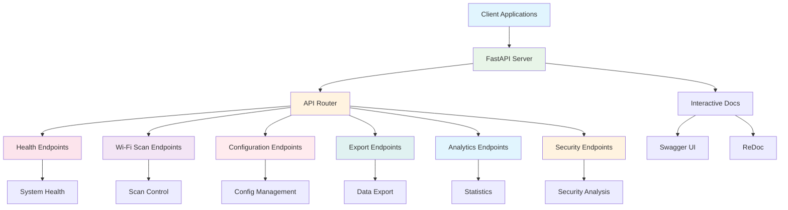
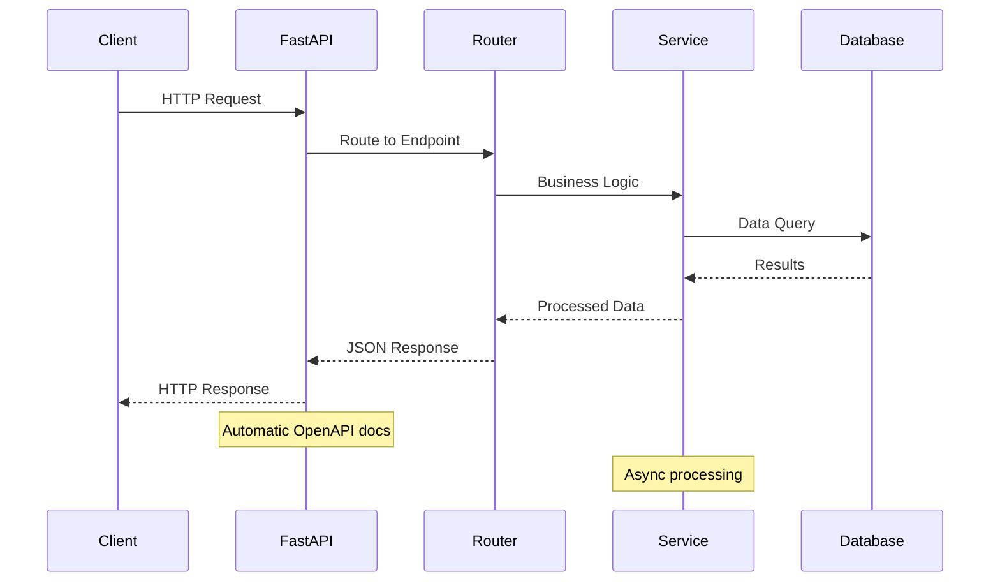

# PiWardrive API Overview

PiWardrive exposes a REST API served by FastAPI. The base URL is `http://localhost:8000/api` unless overridden by `PW_WEBUI_PORT`.

## API Architecture Overview

## API Request Flow

Common endpoints include:

| Endpoint               | Method  | Description                      |
| ---------------------- | ------- | -------------------------------- |
| `/status/health`       | GET     | Return system health information |
| `/wifi/scan`           | POST    | Start a Wi-Fi scan               |
| `/wifi/scan/{scan_id}` | GET     | Retrieve results for a scan      |
| `/config`              | GET/PUT | Read or update configuration     |
| `/export/scans`        | GET     | Export scan data                 |
| `/analytics/daily-stats` | GET | Daily detection statistics |
| `/analytics/coverage-grid` | GET | Network coverage grid |
| `/security/suspicious` | GET | List suspicious activities |

See `docs/api.md` for the complete OpenAPI specification and advanced examples.

Interactive API documentation is available when running the server:

- Swagger UI: `http://localhost:8000/docs`
- ReDoc: `http://localhost:8000/redoc`

For a simple demonstration of the detection services see
`examples/security_analysis_example.py`.
