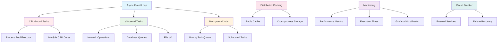
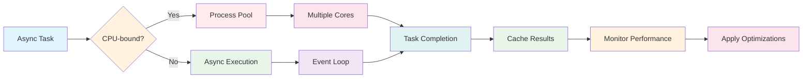

# Async Performance Optimization

This guide summarizes best practices for combining asyncio with CPU-bound workloads in PiWardrive.

## Async Performance Architecture

## Performance Optimization Flow

## Process pool

Use `piwardrive.cpu_pool.run_cpu_bound` to execute expensive computations in a separate `ProcessPoolExecutor`. This prevents blocking the main event loop and allows multiple CPU cores to be utilized.

## Task priority

Background jobs can be scheduled using `PriorityTaskQueue` which processes tasks based on priority values. Lower numbers run first.

## Distributed caching

`RedisCache` stores results across processes. Call `.set(key, value, ttl)` to persist values and `.invalidate(key)` to remove them.

## Monitoring

Wrap critical sections with `performance.record(name)` to capture execution times. Metrics are available via `performance.get_metrics()` and can be visualized in Grafana.

## Circuit breaker

External services may become unreliable. Wrap async calls with `CircuitBreaker` to stop issuing requests after repeated failures and automatically recover after a timeout.
