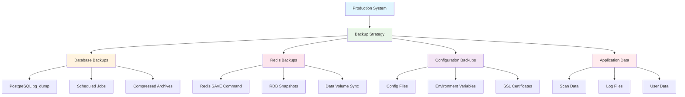

# Backup and Disaster Recovery

This document outlines basic backup and recovery operations for a production
PiWardrive deployment.

## Backup Strategy Overview



## Recovery Process Flow


## Database Backups

Run scheduled `pg_dump` jobs from the PostgreSQL container:

```bash
docker compose --file deploy/docker-compose.production.yml exec postgres \
  pg_dump -U piwardrive piwardrive | gzip > /backups/piwardrive.sql.gz
```

## Redis Backups

The Redis container stores data under `/data`. Create snapshots with:

```bash
docker compose --file deploy/docker-compose.production.yml exec redis \
  redis-cli save
```

## Restore Procedure

1. Stop the application containers.
2. Restore the PostgreSQL dump using `pg_restore`.
3. Copy Redis dump files back to the volume.
4. Start the stack and verify the application health endpoint.
