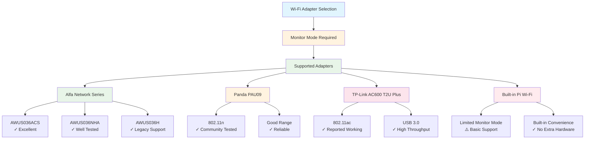
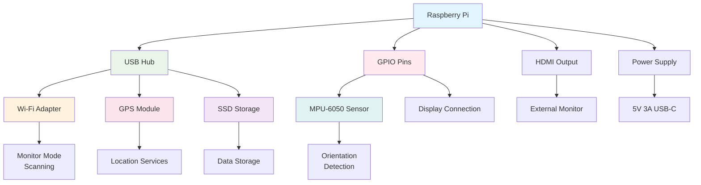

# Hardware Compatibility

This document outlines the hardware components tested and supported by PiWardrive, along with compatibility notes and troubleshooting tips.

## Supported Platforms

### Primary Platform
- **Raspberry Pi 5** - Recommended platform with full feature support
- **Raspberry Pi 4** - Well tested and supported
- **Raspberry Pi 3B+** - Supported with reduced performance

### Display Hardware
- **Official 7" Raspberry Pi Touchscreen** - Primary tested display
- **HDMI monitors** - Supported for desktop usage
- **Touch displays** - Requires proper `/dev/input/eventX` configuration

## Storage Requirements

### Primary Storage
- **SSD via USB 3.0** - Recommended for performance and reliability
- **High-quality microSD card** - Minimum Class 10, UHS-I recommended
- **Mount point**: `/mnt/ssd` (configurable via environment variables)

### Configuration
Add to `/etc/fstab` for automatic SSD mounting:
```bash
/dev/sda1  /mnt/ssd  ext4  defaults,nofail  0  2
```

## GPS Hardware

### Supported GPS Modules
- **USB GPS dongles** - Most NMEA-compatible modules
- **Serial GPS modules** - Connected via UART pins
- **Default device**: `/dev/ttyACM0`
- **Protocol**: NMEA over serial

### Wiring (Serial GPS)
```
GPS VCC  → Pi 3V3 (Pin 1)
GPS GND  → Pi GND (Pin 6)
GPS TX   → Pi RXD (GPIO15, Pin 10)
GPS RX   → Pi TXD (GPIO14, Pin 8)
```

### Configuration
Managed by `gpsd` service:
- **Default port**: `2947`
- **Environment variables**: `PW_GPSD_HOST`, `PW_GPSD_PORT`

## Wi-Fi Adapters

### Hardware Compatibility Matrix



### Hardware Setup Diagram



### Monitor Mode Capable
Required for wireless scanning functionality:
- **Alfa Network adapters** - Well tested (AWUS036ACS, AWUS036NHA)
- **Panda PAU09** - Community tested
- **TP-Link AC600 T2U Plus** - Reported working
- **Built-in Pi Wi-Fi** - Limited monitor mode support

### Compatibility Requirements
- **802.11ac/ax support** recommended
- **External antenna** preferred for better range
- **USB 3.0** recommended for high-throughput scanning

## Orientation Sensors

### Built-in Sensors (Pi 5/4)
- **iio-sensor-proxy** - Access via D-Bus
- **Required packages**: `python3-dbus`
- **Automatic detection** when available

### External MPU-6050
I²C accelerometer/gyroscope module:

#### Wiring
```
MPU-6050 VCC → Pi 3V3 (Pin 1)
MPU-6050 GND → Pi GND (Pin 6)  
MPU-6050 SDA → Pi SDA (GPIO2, Pin 3)
MPU-6050 SCL → Pi SCL (GPIO3, Pin 5)
```

#### Installation
```bash
sudo apt install python3-smbus
pip install mpu6050
```

#### Configuration
- **Default I²C address**: `0x68`
- **Environment variable**: `PW_MPU6050_ADDR`

## Input Devices

### Touch Screen Support
- **Capacitive touch** - Preferred for responsiveness
- **Resistive touch** - Supported with proper calibration
- **Multi-touch** - Supported where available

### Configuration
1. Install event testing tools:
   ```bash
   sudo apt install evtest
   ```

2. Identify touch device:
   ```bash
   sudo evtest
   ```

3. Configure in application settings

## Power Requirements

### Recommended Specifications
- **Raspberry Pi 5**: 5V 3A minimum, 5V 5A for external devices
- **Raspberry Pi 4**: 5V 3A minimum
- **External Wi-Fi adapter**: Additional 500mA-1A
- **GPS module**: 50-100mA
- **SSD**: 2-3W additional power draw

### Power Supply Notes
- **Quality power supply essential** - Prevents USB errors and corruption
- **USB-C PD preferred** for Pi 5
- **Micro-USB** for older Pi models
- **Consider powered USB hub** for multiple external devices

## Tested Configurations

### Recommended Setup
```
Raspberry Pi 5 (8GB)
+ Official 7" touchscreen
+ Samsung T7 1TB SSD (USB-C)
+ Alfa AWUS036ACS Wi-Fi adapter
+ USB GPS dongle (VK-172)
+ Official Pi 5 case with fan
+ Official Pi 27W USB-C power supply
```

### Budget Setup
```
Raspberry Pi 4B (4GB)
+ HDMI monitor
+ SanDisk Extreme 128GB microSD
+ TP-Link AC600 T2U Plus
+ Serial GPS module (UART)
+ Standard Pi 4 case
+ Official Pi 15W power supply
```

## Known Issues

### Wi-Fi Adapter Problems
- **USB errors under load** - Usually power-related, upgrade power supply
- **Monitor mode not supported** - Check adapter chipset compatibility
- **Interface naming changes** - Use persistent udev rules if needed

### GPS Issues
- **Device not found** - Check `dmesg` for USB enumeration
- **Permission denied** - Add user to `dialout` group
- **No fix acquired** - Ensure clear sky view, check antenna connection

### Storage Issues
- **SSD not mounting** - Check power supply capacity
- **Database corruption** - Ensure proper shutdown procedures
- **Slow write speeds** - Use high-quality storage media

### Touch Screen Issues
- **Touch not responding** - Verify correct `/dev/input/eventX` device
- **Calibration off** - Run touch calibration utility
- **Ghost touches** - Check for electrical interference

## Performance Notes

### CPU Usage
- **Scanning intensive** - Monitor CPU temperature
- **Background processes** - Disable unnecessary services
- **Thermal throttling** - Ensure adequate cooling

### Memory Usage
- **Database size** - Regular cleanup recommended
- **Log rotation** - Configured automatically
- **Swap usage** - Monitor on systems with limited RAM

### Network Performance
- **Multiple adapters** - May require USB bandwidth management
- **High packet rates** - Can saturate USB bus on older Pi models

## Troubleshooting Commands

### Hardware Detection
```bash
# List USB devices
lsusb

# Check GPS device
sudo dmesg | grep tty

# Test Wi-Fi adapter
iw list

# Check I²C devices  
sudo i2cdetect -y 1

# Monitor system resources
htop
```

### Service Status
```bash
# Check GPS daemon
sudo systemctl status gpsd

# Check Kismet
sudo systemctl status kismet

# Check system logs
sudo journalctl -u piwardrive-webui
```

## Getting Help

### Community Resources
- **GitHub Issues** - Bug reports and feature requests
- **Documentation** - [`docs/`](docs/) directory
- **Examples** - [`examples/`](examples/) directory

### Debug Information
When reporting hardware issues, include:
- `lsusb` output
- `dmesg` relevant entries
- System specifications
- Power supply details
- Error messages from logs

---

> **Note**: Hardware compatibility may vary. Test thoroughly before deployment in critical environments.
