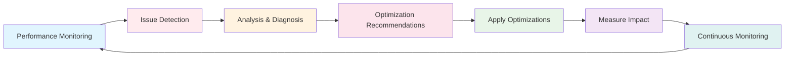

# Performance Optimization Tools Documentation

## Overview

This document provides comprehensive documentation for the performance optimization tools and dashboard integrated into PiWardrive. These tools help identify, analyze, and resolve performance bottlenecks in database operations, async processing, and real-time updates.

### Performance Optimization Architecture

```mermaid
graph TB
    A[Performance Optimization System] --> B[Database Optimizer]
    A --> C[Async Optimizer]
    A --> D[Real-time Optimizer]
    A --> E[Performance Dashboard]
    
    B --> B1[Query Analysis]
    B --> B2[Index Optimization]
    B --> B3[PRAGMA Tuning]
    B --> B4[Statistics Collection]
    
    C --> C1[Operation Monitoring]
    C --> C2[Task Queue Management]
    C --> C3[Resource Pool Management]
    C --> C4[Circuit Breaker]
    
    D --> D1[WebSocket Optimization]
    D --> D2[Connection Management]
    D --> D3[Data Streaming]
    D --> D4[Performance Monitoring]
    
    E --> E1[Real-time Metrics]
    E --> E2[Performance Graphs]
    E --> E3[Optimization Recommendations]
    E --> E4[Alert System]
    
    style A fill:#e1f5fe
    style B fill:#e8f5e8
    style C fill:#fff3e0
    style D fill:#fce4ec
    style E fill:#f3e5f5
```



### Optimization Flow



## Components

### 1. Database Optimizer (`db_optimizer.py`)

The DatabaseOptimizer provides comprehensive SQLite database performance analysis and optimization.

#### Key Features:
- **Query Analysis**: Monitors query execution times and patterns
- **Index Recommendations**: Suggests optimal indexes for slow queries
- **PRAGMA Tuning**: Optimizes SQLite settings for better performance
- **Statistics Collection**: Gathers detailed performance metrics
- **Automated Optimization**: Runs optimization routines automatically

#### Usage:
```python
from piwardrive.performance import DatabaseOptimizer

# Initialize the optimizer
db_optimizer = DatabaseOptimizer("/path/to/database.db")

# Get current statistics
stats = db_optimizer.get_stats()
print(f"Average query time: {stats['avg_query_time']:.3f}s")

# Get optimization recommendations
recommendations = db_optimizer.get_recommendations()
for rec in recommendations:
    print(f"Recommendation: {rec['type']} - {rec['table']}.{rec['column']}")

# Run optimization
result = db_optimizer.optimize()
print(f"Optimization result: {result['status']}")
```

### 2. Async Optimizer (`async_optimizer.py`)

The AsyncOptimizer manages and optimizes asynchronous operations performance.

#### Key Features:
- **Operation Monitoring**: Tracks async operation performance
- **Task Queue Management**: Optimizes task scheduling and execution
- **Resource Pool Management**: Manages connection and thread pools
- **Rate Limiting**: Prevents resource exhaustion
- **Circuit Breaker**: Prevents cascading failures
- **Batch Processing**: Optimizes bulk operations

#### Usage:
```python
from piwardrive.performance import AsyncOptimizer

# Initialize the optimizer
async_optimizer = AsyncOptimizer()

# Monitor an async operation
async with async_optimizer.monitor_operation("api_call") as monitor:
    result = await some_async_operation()
    
# Get performance statistics
stats = async_optimizer.get_stats()
print(f"Total operations: {stats['total_operations']}")
print(f"Failed operations: {stats['failed_operations']}")

# Process tasks in batches
async def process_batch(items):
    return await async_optimizer.process_batch(items, batch_size=100)
```

### 3. Real-time Optimizer (`realtime_optimizer.py`)

The RealtimeOptimizer focuses on WebSocket and Server-Sent Events performance.

#### Key Features:
- **Connection Management**: Optimizes WebSocket connections
- **Data Streaming**: Efficient real-time data delivery
- **Performance Monitoring**: Tracks connection and response metrics
- **Automatic Optimization**: Adjusts settings based on performance data
- **Resource Management**: Prevents connection exhaustion

#### Usage:
```python
from piwardrive.performance import RealtimeOptimizer

# Initialize the optimizer
rt_optimizer = RealtimeOptimizer()

# Optimize WebSocket connections
await rt_optimizer.optimize_websockets()

# Get performance statistics
stats = rt_optimizer.get_stats()
print(f"Active connections: {stats['total_connections']}")
print(f"Average response time: {stats['avg_response_time']:.3f}s")
```

### 4. Performance CLI (`performance_cli.py`)

A command-line interface for managing performance optimization tasks.

#### Available Commands:

##### Analyze Performance
```bash
python scripts/performance_cli.py analyze
```
Performs comprehensive analysis of database, async, and real-time performance.

##### Optimize Components
```bash
# Optimize database
python scripts/performance_cli.py optimize --component database

# Optimize async operations
python scripts/performance_cli.py optimize --component async

# Optimize real-time updates
python scripts/performance_cli.py optimize --component realtime

# Optimize all components
python scripts/performance_cli.py optimize --all
```

##### Monitor Performance
```bash
# Monitor for 60 seconds
python scripts/performance_cli.py monitor --duration 60

# Monitor with custom interval
python scripts/performance_cli.py monitor --interval 5
```

##### Run Benchmarks
```bash
# Run database benchmark
python scripts/performance_cli.py benchmark --component database

# Run all benchmarks
python scripts/performance_cli.py benchmark --all
```

### 5. Performance Dashboard

A web-based dashboard for real-time performance monitoring and management.

#### Access
Once integrated, the dashboard is available at:
- Stats: `GET /performance/stats`
- Alerts: `GET /performance/alerts`
- Recommendations: `GET /performance/recommendations`
- Optimize: `POST /performance/optimize`
- Dashboard UI: `/performance/dashboard`

#### Dashboard Features:
- **Real-time Metrics**: Live performance statistics
- **Interactive Charts**: Visual performance trends
- **Alert System**: Immediate notification of issues
- **Optimization Controls**: One-click optimization
- **Historical Data**: Performance trends over time

## Integration Guide

### Step 1: Install Dependencies
All required dependencies are already included in the main `requirements.txt` file.

### Step 2: Initialize Performance Monitoring
```python
from piwardrive.performance import DatabaseOptimizer, AsyncOptimizer, RealtimeOptimizer

# Initialize optimizers
db_optimizer = DatabaseOptimizer("/path/to/database.db")
async_optimizer = AsyncOptimizer()
rt_optimizer = RealtimeOptimizer()

# Start monitoring
await async_optimizer.start_monitoring()
await rt_optimizer.start_monitoring()
```

### Step 3: Access the Dashboard
The performance dashboard is automatically available at `/performance/dashboard` when the FastAPI application is running.

### Step 4: Set up Automated Optimization
```python
import asyncio
from piwardrive.performance import DatabaseOptimizer, AsyncOptimizer, RealtimeOptimizer

async def automated_optimization():
    """Run automated optimization every hour."""
    db_optimizer = DatabaseOptimizer()
    async_optimizer = AsyncOptimizer()
    rt_optimizer = RealtimeOptimizer()
    
    while True:
        # Run optimizations
        await db_optimizer.optimize()
        await async_optimizer.optimize()
        await rt_optimizer.optimize()
        
        # Wait 1 hour
        await asyncio.sleep(3600)

# Start automated optimization
asyncio.create_task(automated_optimization())
```

## Configuration

### Database Optimization Settings
```python
# Database optimizer settings
DB_OPTIMIZER_SETTINGS = {
    "analyze_threshold": 0.1,  # Seconds - queries slower than this are analyzed
    "vacuum_threshold": 0.3,   # Fragmentation ratio to trigger vacuum
    "cache_size": 10000,       # SQLite cache size in pages
    "temp_store": "memory",    # Use memory for temporary storage
    "synchronous": "normal",   # Sync mode for reliability vs performance
}
```

### Async Optimization Settings
```python
# Async optimizer settings
ASYNC_OPTIMIZER_SETTINGS = {
    "max_pool_size": 100,      # Maximum connection pool size
    "task_queue_size": 1000,   # Maximum task queue size
    "rate_limit": 1000,        # Requests per second limit
    "batch_size": 50,          # Default batch processing size
    "circuit_breaker_threshold": 5,  # Failures before circuit opens
}
```

### Real-time Optimization Settings
```python
# Real-time optimizer settings
REALTIME_OPTIMIZER_SETTINGS = {
    "max_connections": 1000,   # Maximum WebSocket connections
    "heartbeat_interval": 30,  # Heartbeat interval in seconds
    "message_queue_size": 100, # Per-connection message queue size
    "compression": True,       # Enable WebSocket compression
    "buffer_size": 65536,      # WebSocket buffer size
}
```

## Monitoring and Alerting

### Performance Metrics
The system tracks various performance metrics:

**Database Metrics:**
- Query execution times
- Connection pool usage
- Lock contention
- Index effectiveness
- Cache hit ratios

**Async Metrics:**
- Operation completion times
- Task queue lengths
- Resource pool utilization
- Error rates
- Throughput

**Real-time Metrics:**
- WebSocket connection counts
- Message delivery times
- Connection failure rates
- Data throughput
- Memory usage

### Alert Levels
- **Info**: Normal operational information
- **Warning**: Performance degradation detected
- **Critical**: Immediate attention required
- **Emergency**: System failure imminent

### Automated Responses
The system can automatically respond to certain conditions:
- Scale connection pools under high load
- Restart failed components
- Throttle requests when overloaded
- Switch to degraded mode when necessary

## Best Practices

1. **Regular Monitoring**: Check performance metrics daily
2. **Proactive Optimization**: Run optimization routines regularly
3. **Alert Management**: Configure alerts for your specific thresholds
4. **Historical Analysis**: Review performance trends weekly
5. **Capacity Planning**: Use metrics to plan for growth
6. **Testing**: Test optimizations in a staging environment first

## Troubleshooting

### Common Issues

**High Database Query Times:**
1. Check for missing indexes
2. Analyze query patterns
3. Consider database schema optimization
4. Review connection pool settings

**Async Operation Failures:**
1. Check resource pool limits
2. Monitor task queue sizes
3. Review error logs
4. Verify network connectivity

**Real-time Connection Issues:**
1. Check WebSocket connection limits
2. Monitor memory usage
3. Review firewall settings
4. Check client connection handling

### Performance Tuning Tips

1. **Database Tuning:**
   - Add indexes for frequently queried columns
   - Use PRAGMA settings appropriate for your workload
   - Regular VACUUM operations
   - Monitor and optimize slow queries

2. **Async Tuning:**
   - Adjust pool sizes based on workload
   - Use batching for bulk operations
   - Implement proper error handling
   - Monitor resource usage

3. **Real-time Tuning:**
   - Optimize message payloads
   - Use compression for large messages
   - Implement connection pooling
   - Monitor connection lifecycle

## Support

For issues or questions regarding the performance optimization tools:

1. Check the logs in `/var/log/piwardrive/performance.log`
2. Review the performance dashboard for insights
3. Run diagnostic commands using the CLI tool
4. Consult the main PiWardrive documentation
5. Report issues via the project's issue tracker

## Future Enhancements

Planned improvements for the performance optimization system:

1. **PostgreSQL Support**: Full PostgreSQL optimization support
2. **Redis Caching**: Distributed caching integration
3. **Microservices**: Service mesh performance optimization
4. **Machine Learning**: AI-driven performance optimization
5. **Cloud Integration**: Cloud-native performance features
