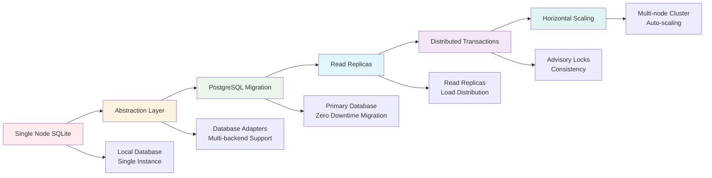

# Scaling Architecture

This document outlines a progressive strategy for migrating from a single-node
SQLite deployment to a horizontally scalable PostgreSQL setup.

## Scaling Strategy Overview

## Architecture Evolution

```mermaid
graph TB
    subgraph "Phase 1: Single Node"
        A1[Application] --> B1[SQLite Database]
        A1 --> C1[Local Storage]
    end
    
    subgraph "Phase 2: Abstraction Layer"
        A2[Application] --> B2[Database Adapter]
        B2 --> C2[SQLite Backend]
        B2 --> D2[PostgreSQL Backend]
        B2 --> E2[MySQL Backend]
    end
    
    subgraph "Phase 3: PostgreSQL Migration"
        A3[Application] --> B3[PostgreSQL Adapter]
        B3 --> C3[PostgreSQL Primary]
        D3[Migration Script] --> C3
        D3 --> E3[SQLite Source]
    end
    
    subgraph "Phase 4: Read Replicas"
        A4[Application] --> B4[Load Balancer]
        B4 --> C4[PostgreSQL Primary]
        B4 --> D4[Read Replica 1]
        B4 --> E4[Read Replica 2]
        C4 --> D4
        C4 --> E4
    end
    
    subgraph "Phase 5: Horizontal Scaling"
        A5[Load Balancer] --> B5[App Instance 1]
        A5 --> C5[App Instance 2]
        A5 --> D5[App Instance 3]
        B5 --> E5[PostgreSQL Cluster]
        C5 --> E5
        D5 --> E5
    end
    
    style A1 fill:#ffebee
    style A2 fill:#fff3e0
    style A3 fill:#e8f5e8
    style A4 fill:#e1f5fe
    style A5 fill:#f3e5f5
```

## Phases

1. **Abstraction Layer** – Introduce a database adapter pattern supporting
   SQLite, PostgreSQL and MySQL backends.  Existing persistence code can switch
   adapters without changing business logic.
2. **PostgreSQL Migration** – Deploy PostgreSQL alongside the existing SQLite
   database.  Data is copied using `migrate_sqlite_to_postgres.py` while the
   application continues to write to SQLite.  Once synchronization completes the
   service switches to the PostgreSQL adapter.
3. **Read Replicas** – Configure read-only replicas of the PostgreSQL primary.
   The `PostgresAdapter` performs round-robin load balancing for SELECT queries.
4. **Distributed Transactions** – Critical operations acquire advisory locks
   inside a transaction.  The `DatabaseManager` exposes `distributed_lock()`
   which wraps the adapter transaction and prevents concurrent writers.
5. **Horizontal Scaling** – Multiple application instances connect to the same
   PostgreSQL cluster with connection pooling via `asyncpg`.  Load balancers can
   distribute requests across nodes.

## Zero Downtime Migration

1. Start a PostgreSQL instance and run the migration script.
2. Verify data integrity using `validate_migration.py`.
3. Configure the application to use the `PostgresAdapter` while keeping the
   SQLite database as a fallback until the new backend is stable.

## Data Consistency

Row counts are compared across databases during validation.  Additional checks
can be implemented by querying hashes of table contents.

## Distributed Locking

`DatabaseManager.distributed_lock()` uses an asyncio lock combined with database
transactions to protect critical sections across the cluster.  PostgreSQL uses
`pg_advisory_xact_lock` to ensure only one writer performs an operation at a
time.

