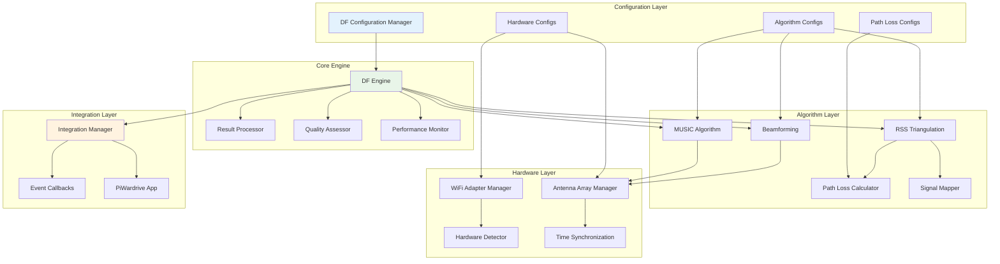
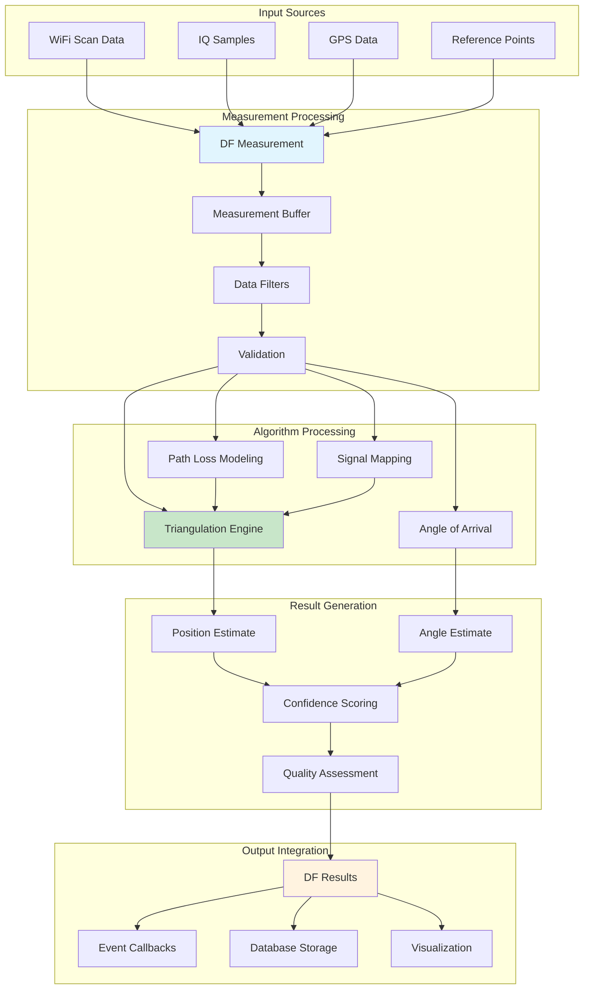
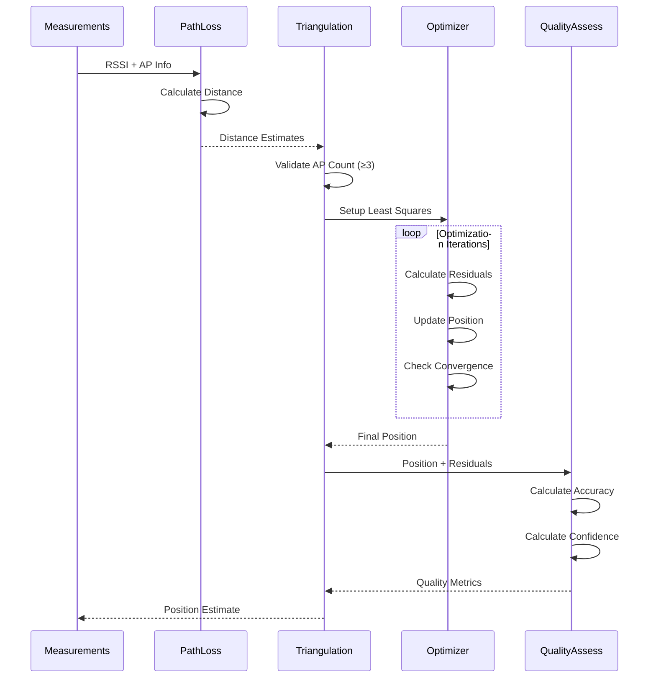
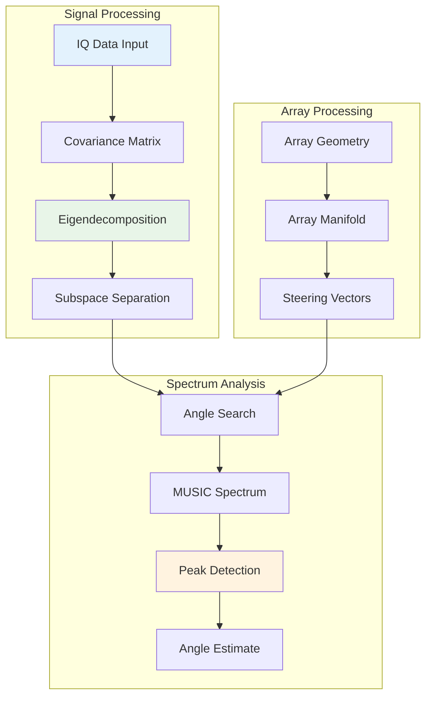
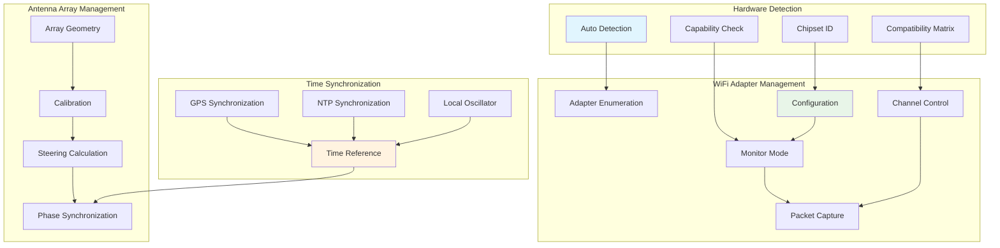

# PiWardrive Direction Finding Module

Advanced, configurable direction finding functionality for PiWardrive that implements RSS-based triangulation, MUSIC angle-of-arrival estimation, beamforming, and other DF techniques.

## Architecture Overview

### Direction Finding System Architecture



### Data Flow Architecture



## RSS Triangulation Process



## MUSIC Algorithm Flow



## Hardware Integration Architecture



### Phase 1 (Implemented)
- **RSS-based Triangulation**: Position estimation using received signal strength
- **Path Loss Modeling**: Multiple path loss models (Free Space, Hata, Indoor, etc.)
- **Signal Mapping**: Real-time signal strength mapping with interpolation
- **Hardware Management**: WiFi adapter and antenna array management
- **Configurable Algorithms**: All algorithms and parameters are configurable

### Phase 2 (Planned)
- **MUSIC Algorithm**: Multiple Signal Classification for angle-of-arrival
- **Beamforming**: Adaptive beamforming for directional signal processing
- **BLE Direction Finding**: Support for BLE 5.1+ AoA/AoD
- **Advanced Visualization**: 3D visualization and real-time plotting

### Phase 3 (Planned)
- **Bluetooth Classic DF**: Direction finding for Bluetooth Classic devices
- **IoT Protocol Support**: DF for Zigbee, Z-Wave, Thread, etc.
- **Machine Learning**: Neural network-based position estimation
- **Multi-Protocol Fusion**: Combining multiple protocols for improved accuracy

## Architecture

The direction finding module consists of several key components:

### Configuration (`config.py`)
- **DFConfiguration**: Main configuration class
- **DFConfigManager**: Manages configuration persistence and validation
- **Algorithm Enums**: Defines available algorithms and options
- **Dataclasses**: Configuration for each DF component

### Core Engine (`core.py`)
- **DFEngine**: Main engine coordinating all DF operations
- **DFResult**: Result structure for position and angle estimates
- **DFMeasurement**: Raw measurement data structure
- **Quality Assessment**: Automatic quality assessment for estimates

### Algorithms (`algorithms.py`)
- **RSSTriangulation**: RSS-based position estimation
- **PathLossCalculator**: Path loss modeling and distance calculation
- **MUSICProcessor**: MUSIC algorithm implementation
- **BeamformingProcessor**: Beamforming implementation
- **SignalMapper**: Signal strength mapping and interpolation

### Hardware Management (`hardware.py`)
- **HardwareDetector**: Automatic detection of DF-capable hardware
- **WiFiAdapterManager**: Manages multiple WiFi adapters
- **AntennaArrayManager**: Manages antenna arrays
- **WiFiAdapter**: Individual adapter management

### Integration (`integration.py`)
- **DFIntegrationManager**: Integrates DF with main PiWardrive application
- **Callback System**: Event-driven result handling
- **Performance Monitoring**: Real-time performance metrics

## Quick Start

### Basic Usage

```python
import asyncio
from piwardrive.direction_finding import (
    initialize_df_integration,
    start_df_integration,
    add_df_measurement,
    configure_df,
    DFAlgorithm
)

async def main():
    # Initialize DF system
    df_manager = initialize_df_integration()
    
    # Configure for RSS triangulation
    configure_df({
        'primary_algorithm': DFAlgorithm.RSS_TRIANGULATION,
        'enabled_algorithms': [DFAlgorithm.RSS_TRIANGULATION]
    })
    
    # Start DF processing
    await start_df_integration()
    
    # Add measurements (from your WiFi scanning)
    measurement = {
        'signal_strength': -60.0,
        'frequency': 2.4e9,
        'bssid': '00:11:22:33:44:55',
        'timestamp': time.time()
    }
    add_df_measurement(measurement)

asyncio.run(main())
```

### Advanced Configuration

```python
from piwardrive.direction_finding import (
    DFConfiguration,
    DFConfigManager,
    PathLossModel,
    InterpolationMethod
)

# Create configuration manager
config_manager = DFConfigManager()

# Configure path loss model
config_manager.update_path_loss_config(
    model_type=PathLossModel.INDOOR,
    path_loss_exponent=2.5,
    wall_penetration_loss=12.0
)

# Configure triangulation
config_manager.update_triangulation_config(
    min_access_points=4,
    max_position_error=20.0,
    use_weighted_least_squares=True
)

# Configure signal mapping
config_manager.update_config(
    signal_mapping={
        'interpolation_method': InterpolationMethod.KRIGING,
        'map_resolution': 5.0,
        'enable_real_time': True
    }
)
```

## Hardware Requirements

### Minimum Requirements
- **WiFi Adapters**: 2+ monitor mode capable adapters
- **Processing**: 4+ CPU cores, 8GB+ RAM
- **Operating System**: Linux with network stack access

### Recommended Hardware
- **WiFi Adapters**: 4+ adapters with different chipsets
- **Antenna Arrays**: Multi-element arrays for AoA estimation
- **SDR Devices**: For advanced signal processing
- **GPS**: For time synchronization and positioning reference

### Supported Chipsets
- **Atheros**: ath9k, ath9k_htc
- **Ralink**: rt2800usb, rt2x00
- **MediaTek**: mt7601u, mt76x2u
- **Realtek**: rtl8812au, rtl8821au

## Configuration Options

### Main Configuration
```python
{
    'primary_algorithm': DFAlgorithm.RSS_TRIANGULATION,
    'enabled_algorithms': [DFAlgorithm.RSS_TRIANGULATION],
    'fallback_algorithm': DFAlgorithm.FINGERPRINTING,
    'enable_logging': True,
    'log_level': 'INFO'
}
```

### RSS Triangulation
```python
{
    'min_access_points': 3,
    'max_position_error': 50.0,
    'convergence_threshold': 0.01,
    'use_weighted_least_squares': True,
    'outlier_rejection': True,
    'confidence_threshold': 0.8
}
```

### Path Loss Models
```python
{
    'model_type': PathLossModel.FREE_SPACE,
    'frequency_bands': ['2.4GHz', '5GHz'],
    'environment_type': 'suburban',
    'path_loss_exponent': 2.0,
    'shadow_fading_std': 8.0
}
```

### Antenna Arrays
```python
{
    'array_type': ArrayGeometry.CIRCULAR,
    'num_elements': 8,
    'element_spacing': 0.5,
    'operating_frequency': 2.4e9,
    'enable_calibration': True
}
```

## API Reference

### Core Functions

#### `initialize_df_integration(piwardrive_app=None)`
Initialize DF integration with PiWardrive application.

#### `start_df_integration()`
Start the DF processing engine.

#### `stop_df_integration()`
Stop the DF processing engine.

#### `add_df_measurement(measurement_data)`
Add a measurement to the DF system.

#### `configure_df(config_updates)`
Update DF configuration.

#### `get_df_status()`
Get current DF system status.

### Configuration Functions

#### `get_df_config()`
Get current DF configuration.

#### `set_df_algorithm(algorithm)`
Set primary DF algorithm.

#### `get_algorithm_config(algorithm)`
Get configuration for specific algorithm.

### Hardware Functions

#### `get_df_hardware_capabilities()`
Get hardware capabilities assessment.

## Performance Tuning

### Optimization Tips
1. **Hardware Selection**: Use diverse chipsets for better coverage
2. **Antenna Placement**: Maximize geometric diversity
3. **Frequency Management**: Avoid interference with channel selection
4. **Processing Optimization**: Tune buffer sizes and update rates
5. **Calibration**: Regular calibration improves accuracy

### Performance Monitoring
```python
# Get performance metrics
status = get_df_status()
metrics = status['metrics']

print(f"Processing time: {metrics['average_processing_time']:.3f}s")
print(f"Success rate: {metrics['successful_estimates'] / metrics['total_estimates']:.2%}")
```

## Troubleshooting

### Common Issues

#### No WiFi Adapters Detected
- Check adapter compatibility
- Verify monitor mode support
- Check driver installation

#### Low Accuracy
- Add more reference access points
- Calibrate path loss models
- Check antenna positioning
- Verify time synchronization

#### Performance Issues
- Reduce update rates
- Optimize buffer sizes
- Check CPU usage
- Verify memory availability

### Debug Mode
```python
configure_df({
    'enable_logging': True,
    'log_level': 'DEBUG'
})
```

## Examples

See `examples/direction_finding_example.py` for a complete working example.

## Testing

Run tests with:
```bash
python -m pytest tests/test_direction_finding.py -v
```

## License

This module is part of PiWardrive and follows the same license terms.

## Contributing

1. Follow the existing code structure
2. Add tests for new functionality
3. Update documentation
4. Ensure all algorithms are configurable
5. Maintain backward compatibility

## Future Enhancements

- **Real-time Visualization**: Live plotting of position estimates
- **Machine Learning**: Neural network-based improvements
- **Multi-band Support**: Simultaneous 2.4/5GHz processing
- **Mobile Integration**: Support for mobile wardriving
- **Cloud Processing**: Distributed processing capabilities
